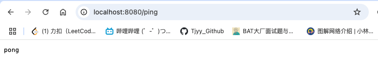

## 第一章 Gin 基础 - 路由配置

项目地址：[路由配置-GinDemo](https://github.com/Tjyy-1223/The-Way-To-Gin/tree/main/code/1-Gin%E5%9F%BA%E7%A1%80/1-1-%E8%B7%AF%E7%94%B1%E9%85%8D%E7%BD%AE/GinDemo)

Gin 是一个高效的 **Web 框架**，主要用于构建 Web 应用程序和 HTTP API。它提供了处理路由、请求、响应和中间件的功能，使得 Web 开发变得更加便捷和高效。Gin 的核心特性是高性能，能够支持高并发请求。

主要功能：

- HTTP 路由和路由分组
- 请求和响应处理
- 中间件支持
- JSON 和表单数据解析
- 错误处理、日志记录等

### 1 Gin Quick Start 

创建一个Gin项目的步骤如下：

1. 新建一个Go项目：GinDemo
2. 如果没有进行初始化，则在根目录下初始化 go.mod 文件: `go mod init GinDemo`
3. 安装Gin：`go get -u github.com/gin-gonic/gin`

4. 在项目根目录下编写一个 main.go 文件

```go
package main

import (
	"github.com/gin-gonic/gin"
	"net/http"
)

func main() {
	r := gin.Default()

	// test router
	r.GET("/ping", func(c *gin.Context) {
		c.String(http.StatusOK, "pong")
	})

	// start the server
	r.Run(":8080")
}
```

5. 执行 go run main.go 启动应用，访问http://localhost:8080/ping , 显示如下则为成功




### 2 路由配置

在Gin中，路由配置是指如何定义HTTP请求与对应的处理函数之间的映射关系。Gin框架使用路由来确定接收到的HTTP请求应该由哪个处理函数来处理。具体的路由配置涉及到设置不同的HTTP方法（如 GET、POST、PUT、DELETE 等）以及请求的路径。

#### 2.1 基本操作

首先，你需要创建一个Gin引擎实例：

```go
import "github.com/gin-gonic/gin"

func main() {
    r := gin.Default() // 创建一个默认的路由引擎实例
    
  	// 在这里进行路由配置
  
  	r.Run(":8080") // 启动在8080端口	
}
```

 使用路由实例 (`r`) 配置不同的路由规则，绑定不同的HTTP方法和路径。常见的路由配置如下：

```go
r.GET("/hello", func(c *gin.Context) {
    c.JSON(200, gin.H{
        "message": "Hello, world!",
    })
})

r.POST("/post", func(c *gin.Context) {
    var json map[string]interface{}
    if err := c.BindJSON(&json); err != nil {
        c.JSON(400, gin.H{"error": "Bad request"})
        return
    }
    c.JSON(200, gin.H{"status": "ok", "data": json})
})
```

+ `r.GET("/hello", ...)` 表示当收到一个GET请求时，路径为 `/hello`，会调用后面的处理函数。
+ `r.POST("/post", ...)` 表示当收到一个POST请求时，路径为 `/post`，会调用后面的处理函数。


#### 2.2 路由组配置 - 案例

这篇文章参考 [Gin 的路由配置](https://github.com/xinliangnote/Go/blob/master/01-Gin%E6%A1%86%E6%9E%B6/02-%E8%B7%AF%E7%94%B1%E9%85%8D%E7%BD%AE.md)，主要包含的功能点如下：

- 实现了，路由分组 v1版本、v2版本。
- 实现了，生成签名和验证验证。
- 实现了，在配置文件中读取配置。

Gin支持路由组，可以将相关的路由组织在一起，方便进行统一的前缀配置和中间件应用,比如我们的接口地址是这样的：

- `/v1/product/add`
- `/v1/member/add`
- `/v2/product/add`
- `/v2/member/add`

假设需求是这样的，接口支持多种请求方式，v1 不需签名验证，v2 需要签名验证，

##### 2.2.1 router

**新建一个 router 包，在其中写入路由文件 router.go：**

```go
package router

import (
	"github.com/gin-gonic/gin"
	"net/url"
	"strconv"
)

// InitRouter 函数用于初始化所有的路由配置
func InitRouter(r *gin.Engine) {
	// 配置一个 GET 请求的路由，路径为 "/sn"，并绑定 SignDemo 处理函数
	r.GET("/sn", SignDemo)
	
	// v1 版本的路由组
	// 这里创建了一个路由组 "/v1"，所有在该组下的路由都会有 "/v1" 前缀
	GroupV1 := r.Group("/v1") {
		// 配置 "/v1/product/add" 路由，支持所有类型的 HTTP 请求（GET、POST、PUT 等），并绑定 v1.AddProduct 处理函数
		GroupV1.Any("/product/add", v1.AddProduct)
		
		// 配置 "/v1/member/add" 路由，支持所有类型的 HTTP 请求，并绑定 v1.AddMember 处理函数
		GroupV1.Any("/member/add", v1.AddMember)
	}
	
	// v2 版本的路由组
	GroupV2 := r.Group("/v2", common.VerifySign) {
		GroupV2.Any("/product/add", v2.AddProduct)
		GroupV2.Any("/member/add", v2.AddMember)
	}
}

// SignDemo 函数用于生成一个签名并返回响应
func SignDemo(c *gin.Context) {
	// 获取当前的 Unix 时间戳，转换成字符串
	ts := strconv.FormatInt(common.GetTimeUnix(), 10)
	
	// 准备返回的响应数据
	res := map[string]interface{}{}
	
	// 构建请求的参数，包含 "name"、"price" 和 "ts"（时间戳）
	params := url.Values{
		"name":  []string{"a"},   // 名称
		"price": []string{"10"},  // 价格
		"ts":    []string{ts},    // 时间戳
	}
	
	// 使用请求参数生成签名，常用于 API 的安全验证
	res["sn"] = common.CreateSign(params)
	
	// 添加时间戳到响应中
	res["ts"] = ts
	
	// 返回 JSON 响应，状态码为 "200"，没有错误消息，包含签名和时间戳
	common.RetJson("200", "", res, c)
}
```

对于 SignDemo 函数的解释如下： 

+ `SignDemo` 是一个 GET 请求的处理函数，用于生成一个签名（通常用于 API 的安全性验证）。
+ `common.GetTimeUnix()`：获取当前时间的 Unix 时间戳（通常是当前时间的秒数）。
+ `url.Values{}`：构建一个 URL 查询参数的集合，这里包含了 `name`、`price` 和 `ts`（时间戳）。
+ `common.CreateSign(params)`：通过 `params` 生成一个签名，通常是为了确保请求的合法性和防止篡改。
+ `common.RetJson("200", "", res, c)`：返回一个 JSON 响应，状态码是 `"200"`，响应体是生成的签名和时间戳。`common.RetJson` 可能是一个自定义的函数，负责统一格式化和返回响应。

##### 2.2.2 common

**接下来，新建一个 common 包以及一个 comon.go 文件**

**common.go 代码如下，其中主要包括生成签名、验证签名相关的处理逻辑：**

```go
package common

import (
	"crypto/md5"
	"encoding/hex"
	"fmt"
	"github.com/gin-gonic/gin"
	"net/http"
	"net/url"
	"sort"
	"strconv"
	"time"
)

func Print(i interface{}) {
	fmt.Println("---")
	fmt.Println(i)
	fmt.Println("---")
}

// RetJson return a JSON
func RetJson(code, msg string, data interface{}, c *gin.Context) {
	c.JSON(http.StatusOK, gin.H{
		"code": code,
		"msg":  msg,
		"data": data,
	})
	c.Abort()
}

// GetTimeUnix return a unix time
func GetTimeUnix() int64 {
	return time.Now().Unix()
}

// MD5 encode and get a hex string
func MD5(str string) string {
	s := md5.New()
	s.Write([]byte(str))
	return hex.EncodeToString(s.Sum(nil))
}

// CreateSign create sign from url.values
func CreateSign(params url.Values) string {
	var key []string
	var str = ""
	for k := range params {
		if k != "sn" {
			key = append(key, k)
		}
	}
	sort.Strings(key)
	for i := 0; i < len(key); i++ {
		if i == 0 {
			str = fmt.Sprintf("%v=%v", key[i], params.Get(key[i]))
		} else {
			str = str + fmt.Sprintf("%v=%v", key[i], params.Get(key[i]))
		}
	}
	// 自定义签名算法
	sign := MD5(MD5(str) + MD5(config.APP_NAME+config.APP_SECRET))
	return sign
}

// VerifySign verify Sign by MD5
func VerifySign(c *gin.Context) {
	var method = c.Request.Method
	var ts int64
	var sn string
	var req url.Values

	if method == "GET" {
		req = c.Request.URL.Query()
		sn = c.Query("sn")
		ts, _ = strconv.ParseInt(c.Query("ts"), 10, 64)
	} else if method == "POST" {
		c.Request.ParseForm()
		req = c.Request.PostForm
		sn = c.PostForm("sn")
		ts, _ = strconv.ParseInt(c.PostForm("ts"), 10, 64)
	} else {
		RetJson("500", "Illegal requests", "", c)
		return
	}

	exp, _ := strconv.ParseInt(config.APP_EXPIRY, 10, 64)

	// 验证过期时间
	if ts > GetTimeUnix() || GetTimeUnix()-ts >= exp {
		RetJson("500", "Time Error", "", c)
		return
	}

	// 验证签名，请求中的携带的签名不正确的话则不能继续
	if sn == "" || sn != CreateSign(req) {
		RetJson("500", "Sign Error", "", c)
		return
	}
}
```

##### 2.2.3 config

config/config.go

```go
package config

const (
	PORT       = ":8080"
	APP_NAME   = "ginDemo"
	APP_SECRET = "6YJSuc50uJ18zj45"
	API_EXPIRY = "120"
)
```

##### 2.2.4 controller

**controller/v1-v2/member.go:**

```go
package v2

import (
	"github.com/gin-gonic/gin"
	"net/http"
)

func AddMember(c *gin.Context) {
	// 获取 Get 参数
	name := c.Query("name")
	price := c.DefaultQuery("price", "100")

	c.JSON(http.StatusOK, gin.H{
		"v2":    "AddMember",
		"name":  name,
		"price": price,
	})
}
```

**controller/v1-v2/product.go:**

```go
package v2

import (
	"github.com/gin-gonic/gin"
	"net/http"
)

func AddProduct(c *gin.Context) {
	// 获取 Get 参数
	name := c.Query("name")
	price := c.DefaultQuery("price", "100")

	c.JSON(http.StatusOK, gin.H{
		"v2":    "AddProduct",
		"name":  name,
		"price": price,
	})
}
```

##### 2.2.5 main.go

```go
package main

import (
	"GinDemo/config"
	"GinDemo/router"
	"github.com/gin-gonic/gin"
)

func main() {
	gin.SetMode(gin.ReleaseMode) // 默认为 debug 模式，设置为发布模式
	r := gin.Default()
	router.InitRouter(r)
	r.Run(config.PORT)
}
```

2.2.6 运行效果

**依次输入下面几个网址可以查看到对应的返回结果：**

```
localhost:8080/v1/product/add?name=a&price=10
localhost:8080/v2/product/add?name=a&price=10
localhost:8080/v2/product/add?name=a&price=10&ts=1563075748
localhost:8080/v2/product/add?name=a&price=10&ts=1563075748&sn=...
```

至此，简单的路由配置已经实现了。


#### 2.3 路由参数

Gin支持路径参数和查询参数：

```go
r.GET("/user/:id", func(c *gin.Context) {
    id := c.Param("id") // 获取路径中的参数
    c.JSON(200, gin.H{"user_id": id})
})

r.GET("/search", func(c *gin.Context) {
    query := c.DefaultQuery("q", "default_query") // 获取查询参数
    c.JSON(200, gin.H{"query": query})
})
```

+ `c.Param("id")` 用于获取路径中的参数值。
+ `c.DefaultQuery("q", "default_query")` 用于获取查询参数，如果查询参数`q`不存在，则使用默认值`"default_query"`。


#### 2.4 中间件

路由配置中还可以使用中间件，进行请求预处理：

```go
r.Use(func(c *gin.Context) {
    fmt.Println("Middleware before request")
    c.Next() // 执行后续的处理函数
    fmt.Println("Middleware after request")
})

r.GET("/ping", func(c *gin.Context) {
    c.JSON(200, gin.H{"message": "pong"})
})
```

假设我们有以下的请求流程：

1. **接收到 HTTP 请求**
   - 当客户端发送一个 `GET /ping` 请求时，Gin 会开始处理这个请求。
2. **中间件执行顺序**
   - 中间件开始执行：
     - 在请求到达路由之前，第一个执行的是注册的中间件。第一个 `fmt.Println("Middleware before request")` 会被打印，表示请求正在被处理中。
   - 路由处理函数执行：
     - 接下来，Gin 会根据路由配置匹配到 `/ping` 路由并执行其对应的处理函数 `c.JSON(200, gin.H{"message": "pong"})`，即返回一个 `200 OK` 状态和 `{ "message": "pong" }` JSON 响应。
   - 中间件继续执行：
     - 在路由处理函数执行完后，Gin 会继续执行中间件中的代码。`fmt.Println("Middleware after request")` 会被打印，表示请求已经处理完成并且响应已经发送。
3. **响应返回给客户端**
   - 最后，客户端会接收到响应，内容是 `{"message": "pong"}`，并且状态码是 `200`。

最后，控制台会看到类似以下的输出：

```
Middleware before request
Middleware after request
```

客户端收到的响应是：

```json
{
  "message": "pong"
}
```

