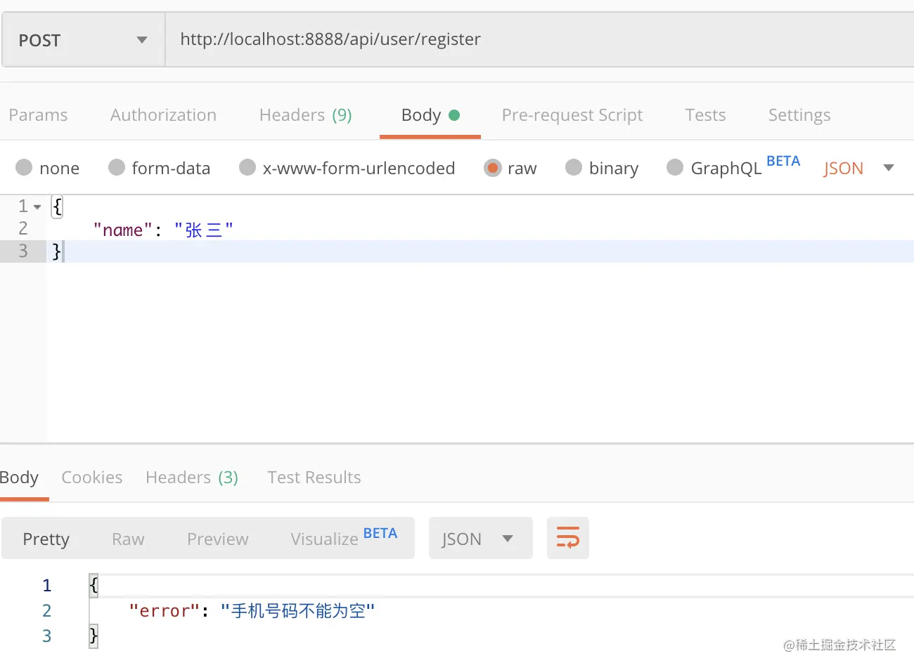
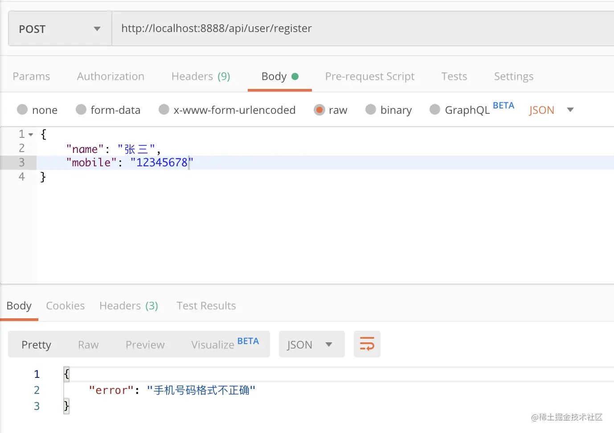
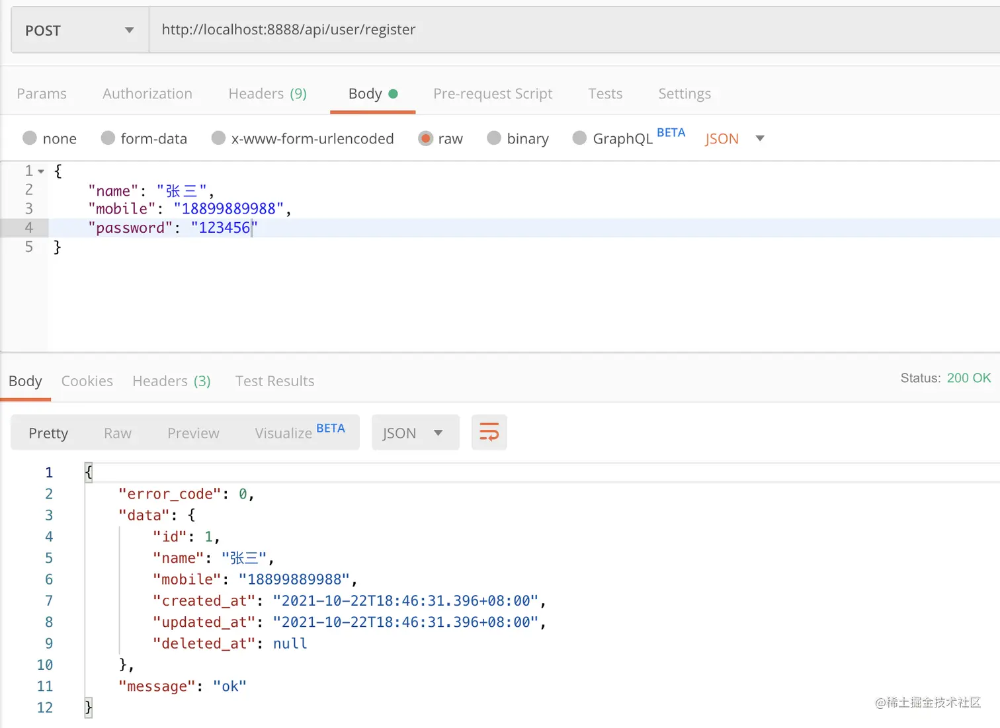
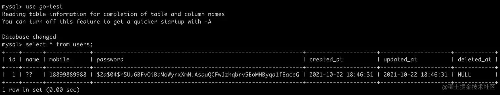

# 第十章 Gin 进阶 - 从零封装属于自己的 Gin 框架 - 初始化 Validator & 封装 Response & 实现第一个接口

学习资料参考：[手把手，带你从零封装Gin框架](https://juejin.cn/post/7018519894828253220)

`Gin ` 自带验证器返回的错误信息格式不太友好，本篇将进行调整，**实现自定义错误信息，并规范接口返回的数据格式，分别为每种类型的错误定义错误码。**

前端可以根据对应的错误码实现后续不同的逻辑操作，篇末会使用自定义的 Validator 和 Response 实现第一个接口。

## 10.1 自定义 Validator 错误信息

**新建 `app/common/request/validator.go` 文件，编写：**

```go
package request

import (
   "github.com/go-playground/validator/v10"
)

type Validator interface {
   GetMessages() ValidatorMessages
}

type ValidatorMessages map[string]string

// GetErrorMsg 获取错误信息
func GetErrorMsg(request interface{}, err error) string {
   if _, isValidatorErrors := err.(validator.ValidationErrors); isValidatorErrors {
      _, isValidator := request.(Validator)

      for _, v := range err.(validator.ValidationErrors) {
         // 若 request 结构体实现 Validator 接口即可实现自定义错误信息
         if isValidator {
            if message, exist := request.(Validator).GetMessages()[v.Field() + "." + v.Tag()]; exist {
               return message
            }
         }
         return v.Error()
      }
   }

   return "Parameter error"
}
```

**新建 `app/common/request/user.go` 文件，用来存放所有用户相关的请求结构体，并实现 `Validator` 接口**

```go
package request

type Register struct {
    Name string `form:"name" json:"name" binding:"required"`
    Mobile string `form:"mobile" json:"mobile" binding:"required"`
    Password string `form:"password" json:"password" binding:"required"`
}

// 自定义错误信息
func (register Register) GetMessages() ValidatorMessages {
    return ValidatorMessages{
        "Name.required": "用户名称不能为空",
        "Mobile.required": "手机号码不能为空",
        "Password.required": "用户密码不能为空",
    }
}
```

在 `routes/api.go` 中编写测试代码

```go
package routes

import (
    "github.com/gin-gonic/gin"
    "jassue-gin/app/common/request"
    "net/http"
    "time"
)

// SetApiGroupRoutes 定义 api 分组路由
func SetApiGroupRoutes(router *gin.RouterGroup) {
    //...
    router.POST("/user/register", func(c *gin.Context) {
        var form request.Register
        if err := c.ShouldBindJSON(&form); err != nil {
           c.JSON(http.StatusOK, gin.H{
               "error": request.GetErrorMsg(form, err),
           })
           return
        }
        c.JSON(http.StatusOK, gin.H{
            "message": "success",
        })
    })
}
```

启动服务器，使用 `Postman` 测试，如下图所示，自定义错误信息成功




## 10.2 自定义 Validator 验证器

有一些验证规则在 `Gin` 框架中是没有的，这个时候我们就需要自定义验证器

新建 `utils/validator.go` 文件，定义验证规则，后续有其他的验证规则将统一存放在这里

```go
package utils

import (
    "github.com/go-playground/validator/v10"
    "regexp"
)

// ValidateMobile 校验手机号
func ValidateMobile(fl validator.FieldLevel) bool {
    mobile := fl.Field().String()
    ok, _ := regexp.MatchString(`^(13[0-9]|14[01456879]|15[0-35-9]|16[2567]|17[0-8]|18[0-9]|19[0-35-9])\d{8}$`, mobile)
    if !ok {
        return false
    }
    return true
}
```

新建 `bootstrap/validator.go` 文件，定制 `Gin` 框架 `Validator` 的属性

```go
package bootstrap

import (
    "github.com/gin-gonic/gin/binding"
    "github.com/go-playground/validator/v10"
    "jassue-gin/utils"
    "reflect"
    "strings"
)

func InitializeValidator() {
    if v, ok := binding.Validator.Engine().(*validator.Validate); ok {
        // 注册自定义验证器
        _ = v.RegisterValidation("mobile", utils.ValidateMobile)

        // 注册自定义 json tag 函数
        v.RegisterTagNameFunc(func(fld reflect.StructField) string {
            name := strings.SplitN(fld.Tag.Get("json"), ",", 2)[0]
            if name == "-" {
                return ""
            }
            return name
        })
    }
}
```

------

其中，**`func(fld reflect.StructField) string`**: 这是注册的函数，它接收一个字段类型 (`reflect.StructField`) 并返回一个字符串，表示字段的名称。

**`fld.Tag.Get("json")`** 用于获取结构体字段的 json 标签。例如：

```go
type User struct {
    Name string `json:"name"`
}
```

在这个例子中， `fld.Tag.Get("json")` 会返回 `"name"`。

`strings.SplitN(fld.Tag.Get("json"), ",", 2)[0]` : 按 `,` 分隔 `json` 标签的内容，并取第一个部分。

标签为 `"name,omitempty"` 时，会分成 `["name", "omitempty"]`，返回 `"name"`。

------

在 `main.go` 中调用

```go
package main

import (
    "jassue-gin/bootstrap"
    "jassue-gin/global"
)

func main() {
    // ...
    
    // 初始化验证器
    bootstrap.InitializeValidator()

    // 启动服务器
    bootstrap.RunServer()
}
```

在 `app/common/request/user.go` 文件，增加 `Resister` 请求结构体中 `Mobile` 属性的验证 tag

**注：由于在 `InitializeValidator()`  方法中，使用 `RegisterTagNameFunc()` 注册了自定义 json tag， 所以在 `GetMessages()` 中自定义错误信息 key 值时，需使用 json tag 名称**

```go
package request

type Register struct {
    Name string `form:"name" json:"name" binding:"required"`
    Mobile string `form:"mobile" json:"mobile" binding:"required,mobile"`
    Password string `form:"password" json:"password" binding:"required"`
}


func (register Register) GetMessages() ValidatorMessages {
    return ValidatorMessages{
        "name.required": "用户名称不能为空",
        "mobile.required": "手机号码不能为空",
        "mobile.mobile": "手机号码格式不正确",
        "password.required": "用户密码不能为空",
    }
}
```

重启服务器，使用 `PostMan` 测试，如下图所示，自定义验证器成功




## 10.3 自定义错误码

新建 `global/error.go` 文件，将项目中可能存在的错误都统一存放到这里，为每一种类型错误都定义一个错误码，便于在开发过程快速定位错误，前端也可以根据不同错误码实现不同逻辑的页面交互

```go
package global

type CustomError struct {
    ErrorCode int
    ErrorMsg string
}

type CustomErrors struct {
    BusinessError CustomError
    ValidateError CustomError
}

var Errors = CustomErrors{
    BusinessError: CustomError{40000, "业务错误"},
    ValidateError: CustomError{42200, "请求参数错误"},
}
```


## 10.4 封装 Response

新建 `app/common/response/response.go` 文件，编写：

```go
package response

import (
    "github.com/gin-gonic/gin"
    "jassue-gin/global"
    "net/http"
)

// 响应结构体
type Response struct {
    ErrorCode int `json:"error_code"` // 自定义错误码
    Data interface{} `json:"data"` // 数据
    Message string `json:"message"` // 信息
}

// Success 响应成功 ErrorCode 为 0 表示成功
func Success(c *gin.Context, data interface{}) {
    c.JSON(http.StatusOK, Response{
        0,
        data,
        "ok",
    })
}

// Fail 响应失败 ErrorCode 不为 0 表示失败
func Fail(c *gin.Context, errorCode int, msg string) {
    c.JSON(http.StatusOK, Response{
        errorCode,
        nil,
        msg,
    })
}

// FailByError 失败响应 返回自定义错误的错误码、错误信息
func FailByError(c *gin.Context, error global.CustomError) {
    Fail(c, error.ErrorCode, error.ErrorMsg)
}

// ValidateFail 请求参数验证失败
func ValidateFail(c *gin.Context, msg string)  {
    Fail(c, global.Errors.ValidateError.ErrorCode, msg)
}

// BusinessFail 业务逻辑失败
func BusinessFail(c *gin.Context, msg string) {
    Fail(c, global.Errors.BusinessError.ErrorCode, msg)
}
```


## 10.5 实现用户注册接口

新建 `utils/bcrypt.go` 文件，编写密码加密及验证密码的方法

```go
package utils

import (
    "golang.org/x/crypto/bcrypt"
    "log"
)

func BcryptMake(pwd []byte) string {
    hash, err := bcrypt.GenerateFromPassword(pwd, bcrypt.MinCost)
    if err != nil {
        log.Println(err)
    }
    return string(hash)
}

func BcryptMakeCheck(pwd []byte, hashedPwd string) bool {
    byteHash := []byte(hashedPwd)
    err := bcrypt.CompareHashAndPassword(byteHash, pwd)
    if err != nil {
        return false
    }
    return true
}
```

**新建 `app/services/user.go` 文件，编写用户注册逻辑**

```go
package services

import (
    "errors"
    "jassue-gin/app/common/request"
    "jassue-gin/app/models"
    "jassue-gin/global"
    "jassue-gin/utils"
)

type userService struct {
}

var UserService = new(userService)

// Register 注册
func (userService *userService) Register(params request.Register) (err error, user models.User) {
    var result = global.App.DB.Where("mobile = ?", params.Mobile).Select("id").First(&models.User{})
    if result.RowsAffected != 0 {
        err = errors.New("手机号已存在")
        return
    }
    user = models.User{Name: params.Name, Mobile: params.Mobile, Password: utils.BcryptMake([]byte(params.Password))}
    err = global.App.DB.Create(&user).Error
    return
}
```

> var result = global.App.DB.Where("mobile = ?", params.Mobile).Select("id").First(&models.User{})
> 这段代码的意思是：
>
> - 在 `users` 表中查找 `mobile` 列值为 `params.Mobile` 的记录。
> - 仅查询 `id` 字段（减少查询的数据量）。
> - 将查询结果的第一条记录填充到一个 `models.User{}` 的实例中。

新建 `app/controllers/app/user.go` 文件，校验入参，调用 `UserService` 注册逻辑

```go
package app

import (
    "github.com/gin-gonic/gin"
    "jassue-gin/app/common/request"
    "jassue-gin/app/common/response"
    "jassue-gin/app/services"
)

// Register 用户注册
func Register(c *gin.Context) {
    var form request.Register
    if err := c.ShouldBindJSON(&form); err != nil {
        response.ValidateFail(c, request.GetErrorMsg(form, err))
        return
    }

    if err, user := services.UserService.Register(form); err != nil {
       response.BusinessFail(c, err.Error())
    } else {
       response.Success(c, user)
    }
}
```

在 `routes/api.go` 中，添加路由

```go
package routes

import (
    "github.com/gin-gonic/gin"
    "jassue-gin/app/controllers/app"
)

// SetApiGroupRoutes 定义 api 分组路由
func SetApiGroupRoutes(router *gin.RouterGroup) {
    router.POST("/auth/register", app.Register)
}
```

使用 `Postman` 调用接口 [http://localhost:8888/api/auth/register](https://link.juejin.cn/?target=http%3A%2F%2Flocalhost%3A8888%2Fapi%2Fauth%2Fregister) ，如下图所示，接口返回成功



查看数据库 `users` 表，数据已成功写入

