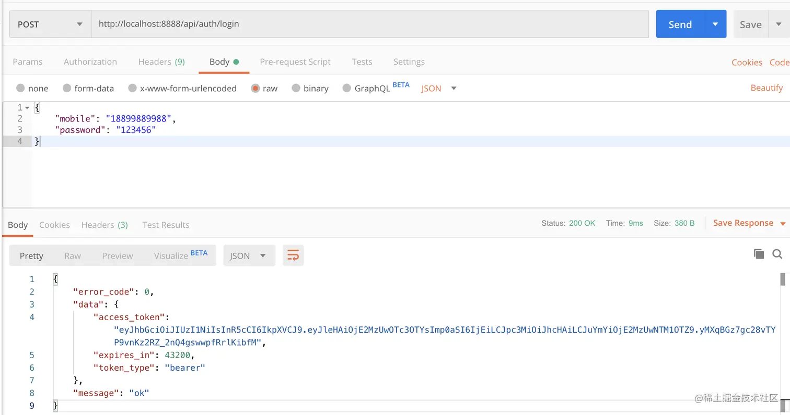
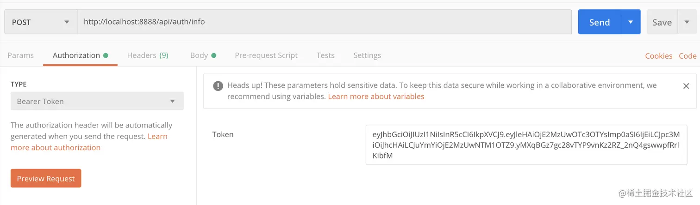
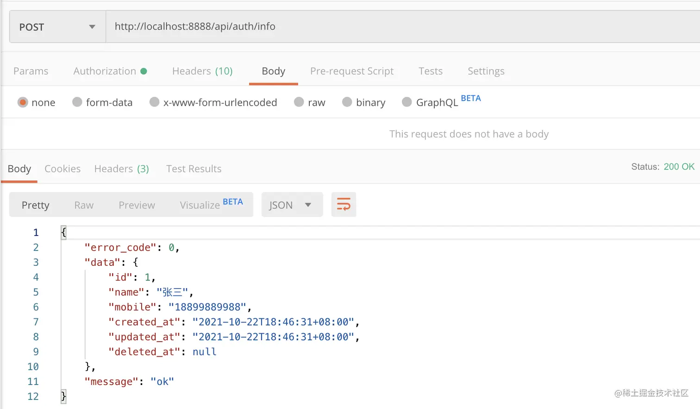

# 第十一章  - 从零封装属于自己的 Gin 框架 - 实现登录接口 & jwt 鉴权中间件

学习资料参考：[手把手，带你从零封装Gin框架](https://juejin.cn/post/7018519894828253220)

这一篇将使用 [jwt-go](https://link.juejin.cn/?target=https%3A%2F%2Fgithub.com%2Fdgrijalva%2Fjwt-go) 包来完成登录接口，颁发 `token` 令牌，并编写 jwt 中间件对 `token` 统一鉴权，避免在各个 `controller` 重复编写鉴权逻辑

## 11.1 鉴权与 JWT

#### 11.1.1 鉴权

在 Web 开发中，**鉴权**（Authorization）是用来确定用户是否有权限访问某个资源或执行某个操作的过程。它通常在身份验证（Authentication）之后进行。以下是关于鉴权的详细说明：

+ **鉴权**主要回答的是：**用户能否访问某个资源或操作？**
+ 它基于用户的身份信息和权限规则，决定是否允许用户执行某些操作。

**鉴权和身份验证的区别：**

**1. 身份验证 (Authentication)**:

- 目的：验证用户的身份（"你是谁"）。
- 示例：用户登录时输入用户名和密码，系统验证它们是否正确。

**2. 鉴权 (Authorization)**:

- 目的：确定用户的权限（"你能做什么"）。
- 示例：用户登录后，系统检查用户是否有权限查看某个页面或调用某个 API。

**鉴权的工作流程：**

**1. 用户登录**:

- 系统先进行身份验证，确认用户身份。
- 例如，生成一个会话（Session）或令牌（Token），作为后续请求的凭证。

**2. 携带凭证访问资源**:

- 用户发起一个请求，附带凭证（如 Token 或 Session ID）。
- 服务端接收请求并验证凭证是否合法。

**3. 权限检查**:

- 根据用户的角色或权限规则，检查用户是否有权访问该资源或执行该操作。

**4. 返回结果**:

- 如果用户有权限：允许操作或返回资源。
- 如果用户无权限：返回权限不足的错误（如 HTTP 状态码 403）。


#### **11.1.2 鉴权的常见实现方式**

**中间件**:

- 在请求进入控制器前进行权限验证。
- 示例：在 Go 中使用 Gin 框架的中间件实现鉴权。

**OAuth 2.0**:

- 用于第三方应用授权，常用于单点登录和资源授权。

**JWT**:

- 常用于无状态鉴权，令牌中携带用户权限信息。

**ACL (访问控制列表)**:

- 定义资源与用户的访问权限关系。


#### 11.1.3 JWT

**JWT（JSON Web Token）** 是一种基于 JSON 格式的轻量级开放标准（RFC 7519），用于在系统的不同部分之间安全地传输信息，常用于认证和信息交换。

JWT 包含三部分，使用点号 `.` 分隔：

```
Header.Payload.Signature
```

1. **Header（头部）**:

   + 描述 JWT 的元信息，包含两个部分

   + 类型（`typ`）：通常为 `"JWT"`。

   + 算法（`alg`）：指定签名的哈希算法，如 `HS256`、`RS256`。

     ```
     {
       "typ": "JWT",
       "alg": "HS256"
     }
     ```

2. **Payload（载荷）**:

   + 包含声明（Claims），是 JWT 的主体数据。

   + Registered Claims（注册声明）：标准化字段，如 `iss`（签发者）、`exp`（过期时间）、`sub`（主题）。

   + Public Claims（公共声明）：用户自定义的公开数据。

   + Private Claims（私有声明）：双方约定的私密数据。

     ```
     {
       "sub": "1234567890",
       "name": "John Doe",
       "admin": true,
       "iat": 1516239022
     }
     ```

3. **Signature（签名）**:

   + 用于验证 JWT 的完整性和真实性。

   + 签名的作用是防止 JWT 被篡改。

   + 生成方式：

     ```
     HMACSHA256(
       base64UrlEncode(header) + "." + base64UrlEncode(payload),
       secret
     )
     ```

**JWT 的工作流程：**

1. **生成 Token**:

   + 用户登录后，服务器验证用户的身份。
   + 如果身份验证成功，服务器根据用户信息生成一个 JWT，签名后返回给用户。

2. **客户端存储 Token**:

   + 客户端通常将 JWT 存储在浏览器的 `localStorage` 或 `cookies` 中。

3. **请求携带 Token**:

   + 在随后的请求中，客户端将 JWT 放在请求头的 `Authorization` 字段中

   + ```
     Authorization: Bearer <token>
     ```

4. **服务器验证 Token**:

   + 服务器接收到请求后，验证 JWT 的签名和有效性（如是否过期）。
   + 如果验证通过，解析 JWT 并提取其中的信息。
   + 根据解析到的用户信息执行相关操作。

**JWT 的优势**

1. **无状态**: JWT 是自包含的，服务端无需存储会话数据，适合分布式系统。

2. **安全性**: 签名保证了数据的完整性，防止被篡改。

3. **灵活性**: JWT 的结构清晰，支持多种声明，适合不同场景。

4. **跨语言**: 基于 JSON，可以在不同语言和平台之间使用。

**JWT 的缺点**

1. **不可撤销**: 一旦签发，无法强制使特定的 JWT 无效，除非设置较短的过期时间。
1. **体积较大**: 包含签名和额外信息，体积可能比传统会话方式略大。
1. **信息泄露风险**: 如果 JWT 被窃取，攻击者可以冒充用户。因此，使用 HTTPS 和安全存储机制至关重要。


## 11.2 鉴权实践

#### 11.2.1 安装

```
go get -u github.com/dgrijalva/jwt-go
```


#### 11.2.2 定义配置项

新建 `config/jwt.go` 文件，编写配置

```go
type Jwt struct {
    Secret string `mapstructure:"secret" json:"secret" yaml:"secret"`
    JwtTtl int64 `mapstructure:"jwt_ttl" json:"jwt_ttl" yaml:"jwt_ttl"` // token 有效期（秒）
}
```

在 `config/config.go` 中，添加 `Jwt` 属性

```go
type Configuration struct {
    App App `mapstructure:"app" json:"app" yaml:"app"`
    Log Log `mapstructure:"log" json:"log" yaml:"log"`
    Database Database `mapstructure:"database" json:"database" yaml:"database"`
    Jwt Jwt `mapstructure:"jwt" json:"jwt" yaml:"jwt"`
}
```

`config.yaml` 添加对应配置

```yaml
jwt:
  secret: 3Bde3BGEbYqtqyEUzW3ry8jKFcaPH17fRmTmqE7MDr05Lwj95uruRKrrkb44TJ4s
  jwt_ttl: 43200
```


#### 11.2.3 编写颁发 Token 逻辑

新建 `app/services/jwt.go` 文件，编写

```go
import (
    "github.com/dgrijalva/jwt-go"
    "jassue-gin/global"
    "time"
)

type jwtService struct {
}

var JwtService = new(jwtService)

// 所有需要颁发 token 的用户模型必须实现这个接口
type JwtUser interface {
    GetUid() string
}

// CustomClaims 自定义 Claims
type CustomClaims struct {
    jwt.StandardClaims
}

const (
    TokenType = "bearer"
    AppGuardName = "app"
)

type TokenOutPut struct {
    AccessToken string `json:"access_token"`
    ExpiresIn int `json:"expires_in"`
    TokenType string `json:"token_type"`
}

// CreateToken 生成 Token
func (jwtService *jwtService) CreateToken(GuardName string, user JwtUser) (tokenData TokenOutPut, err error, token *jwt.Token) {
    token = jwt.NewWithClaims(
        jwt.SigningMethodHS256,
        CustomClaims{
            StandardClaims: jwt.StandardClaims{
                ExpiresAt: time.Now().Unix() + global.App.Config.Jwt.JwtTtl,
                Id:        user.GetUid(),
                Issuer:    GuardName, // 用于在中间件中区分不同客户端颁发的 token，避免 token 跨端使用
                NotBefore: time.Now().Unix() - 1000,
            },
        },
    )

    tokenStr, err := token.SignedString([]byte(global.App.Config.Jwt.Secret))

    tokenData = TokenOutPut{
        tokenStr,
        int(global.App.Config.Jwt.JwtTtl),
        TokenType,
    }
    return
}
```

`CreateToken` 方法需要接收一个 `JwtUser` 实例对象，我们需要将 `app/models/user.go` 用户模型实现 `JwtUser` 接口， 后续其他的用户模型都可以通过实现 `JwtUser` 接口，来调用 `CreateToken()` 颁发 `Token`

```go
package models

import "strconv"

type User struct {
    ID
    Name string `json:"name" gorm:"not null;comment:用户名称"`
    Mobile string `json:"mobile" gorm:"not null;index;comment:用户手机号"`
    Password string `json:"-" gorm:"not null;default:'';comment:用户密码"`
    Timestamps
    SoftDeletes
}

func (user User) GetUid() string {
    return strconv.Itoa(int(user.ID.ID))
}
```


#### 11.2.4 实现登录接口

在 `app/common/request/user.go` 中，新增 `Login` 验证器结构体

```go
type Login struct {
    Mobile string `form:"mobile" json:"mobile" binding:"required,mobile"`
    Password string `form:"password" json:"password" binding:"required"`
}

func (login Login) GetMessages() ValidatorMessages {
    return ValidatorMessages{
        "mobile.required": "手机号码不能为空",
        "mobile.mobile": "手机号码格式不正确",
        "password.required": "用户密码不能为空",
    }
}
```

在 `app/services/user.go` 中，编写 `Login()` 登录逻辑

```go
func (userService *userService) Login(params request.Login) (err error, user *models.User) {
    err = global.App.DB.Where("mobile = ?", params.Mobile).First(&user).Error
    if err != nil || !utils.BcryptMakeCheck([]byte(params.Password), user.Password) {
        err = errors.New("用户名不存在或密码错误")
    }
    return
}
```

新建 `app/controllers/app/auth.go` 文件，编写 `Login()` 进行入参校验，并调用 `UserService` 和 `JwtService` 服务，颁发 `Token`

```go
import (
    "github.com/gin-gonic/gin"
    "jassue-gin/app/common/request"
    "jassue-gin/app/common/response"
    "jassue-gin/app/services"
)

func Login(c *gin.Context) {
    var form request.Login
    if err := c.ShouldBindJSON(&form); err != nil {
        response.ValidateFail(c, request.GetErrorMsg(form, err))
        return
    }

    if err, user := services.UserService.Login(form); err != nil {
        response.BusinessFail(c, err.Error())
    } else {
        tokenData, err, _ := services.JwtService.CreateToken(services.AppGuardName, user)
        if err != nil {
            response.BusinessFail(c, err.Error())
            return
        }
        response.Success(c, tokenData)
    }
}
```

在 `routes/api.go` 中，添加路由

```go
router.POST("/auth/login", app.Login)
```

使用 `Postm`

`an` 调用 [http://localhost:8888/api/auth/login](https://link.juejin.cn?target=http%3A%2F%2Flocalhost%3A8888%2Fapi%2Fauth%2Flogin) ，如下图，成功返回 `Token`，登录成功




#### 11.2.5 编写 jwt 鉴权中间件

在 `global/error.go` 中，定义 `TokenError` 错误

```go
type CustomErrors struct {
    // ...
    TokenError CustomError
}

var Errors = CustomErrors{
    // ...
    TokenError: CustomError{40100, "登录授权失效"},
}
```

在 `app/common/response/response.go` 中，编写 `TokenFail()` ，用于 token 鉴权失败统一返回

```go
func TokenFail(c *gin.Context) {
    FailByError(c, global.Errors.TokenError)
}
```

新建 `app/middleware/jwt.go` 文件，编写

```go
import (
    "github.com/dgrijalva/jwt-go"
    "github.com/gin-gonic/gin"
    "jassue-gin/app/common/response"
    "jassue-gin/app/services"
    "jassue-gin/global"
)

func JWTAuth(GuardName string) gin.HandlerFunc {
    return func(c *gin.Context) {
        tokenStr := c.Request.Header.Get("Authorization")
        if tokenStr == "" {
            response.TokenFail(c)
            c.Abort()
            return
        }
        tokenStr = tokenStr[len(services.TokenType)+1:]

        // Token 解析校验
        token, err := jwt.ParseWithClaims(tokenStr, &services.CustomClaims{}, func(token *jwt.Token) (interface{}, error) {
            return []byte(global.App.Config.Jwt.Secret), nil
        })
        if err != nil {
            response.TokenFail(c)
            c.Abort()
            return
        }

        claims := token.Claims.(*services.CustomClaims)
        // Token 发布者校验
        if claims.Issuer != GuardName {
            response.TokenFail(c)
            c.Abort()
            return
        }

        c.Set("token", token)
        c.Set("id", claims.Id)
    }
}
```


#### 11.2.6 使用 jwt 中间件，实现获取用户信息接口

在 `routes/api.go` 中，使用 `JWTAuth` 中间件，这样一来，客户端需要使用正确的 `Token` 才能访问在 `authRouter` 分组下的路由

```go
func SetApiGroupRoutes(router *gin.RouterGroup) {
    router.POST("/auth/register", app.Register)
    router.POST("/auth/login", app.Login)

    authRouter := router.Group("").Use(middleware.JWTAuth(services.AppGuardName))
    {
        authRouter.POST("/auth/info", app.Info)
    }
}
```

在 `app/services/user.go` 中，编写

```go
// GetUserInfo 获取用户信息
func (userService *userService) GetUserInfo(id string) (err error, user models.User) {
    intId, err := strconv.Atoi(id)
    err = global.App.DB.First(&user, intId).Error
    if err != nil {
        err = errors.New("数据不存在")
    }
    return
}
```

在 `app/controllers/auth.go`中，编写 `Info()`，通过 `JWTAuth` 中间件校验 `Token` 识别的用户 ID 来获取用户信息

```go
func Info(c *gin.Context) {
    err, user := services.UserService.GetUserInfo(c.Keys["id"].(string))
    if err != nil {
        response.BusinessFail(c, err.Error())
        return
    }
    response.Success(c, user)
}
```

使用 `Postman`，先将调用登录接口获取 `Token` 放入 `Authorization` 头，再调用接口 [http://localhost:8888/api/auth/info](https://link.juejin.cn?target=http%3A%2F%2Flocalhost%3A8888%2Fapi%2Fauth%2Finfo)





