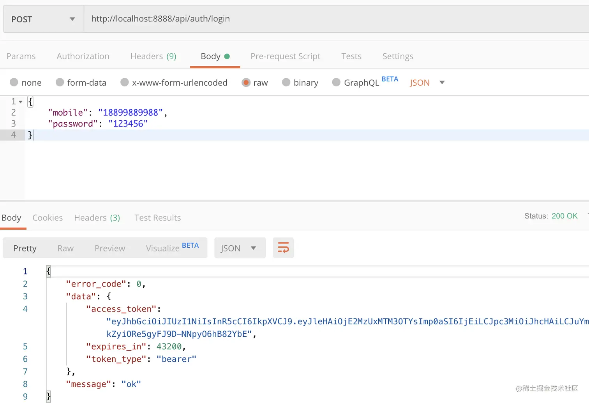
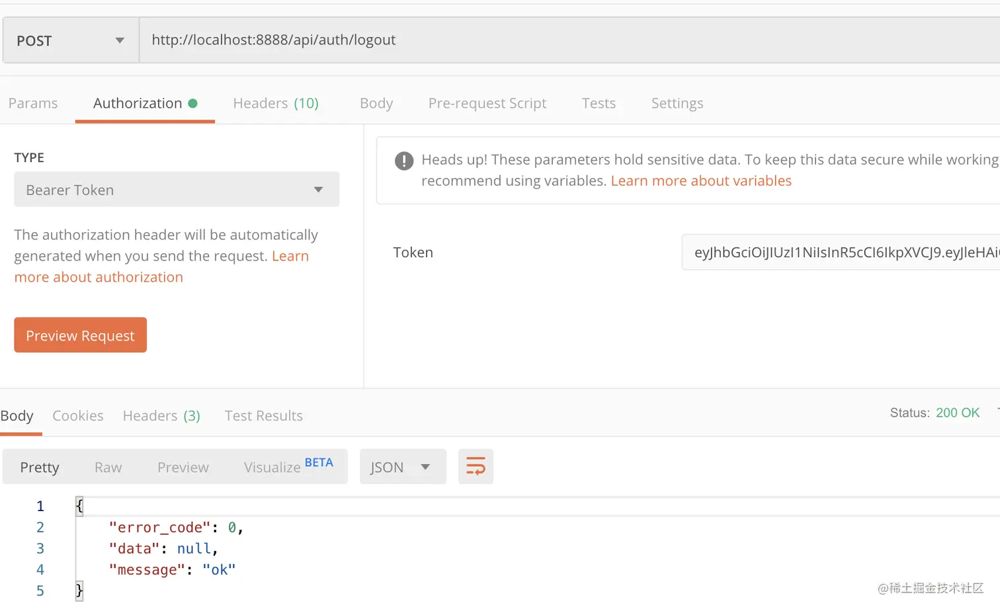
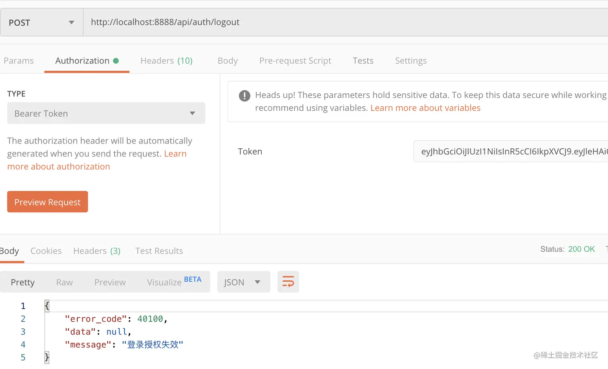

# 第十二章  - 从零封装属于自己的 Gin 框架 - 引入Redis & 解决 JWT 注销问题（黑名单策略）

学习资料参考：[手把手，带你从零封装Gin框架](https://juejin.cn/post/7018519894828253220)

由于 JWT 是无状态的，只能等到它的有效期过了才会失效，服务端无法主动让一个 token 失效，为了解决这个问题，这里使用黑名单策略来解决 JWT 的注销问题

1. 简单来说就将用户主动注销的 token 加入到黑名单（Redis）中，并且必须设置有效期，否则将导致黑名单巨大的问题
2. Jwt 中间件鉴权时判断 token 是否在黑名单中

首先需要安装 redis

```
go get -u github.com/go-redis/redis/v8
```


### 12.1 定义配置

新建 `config/redis.go` 文件，编写配置

```go
package config

type Redis struct {
    Host string `mapstructure:"host" json:"host" yaml:"host"`
    Port int `mapstructure:"port" json:"port" yaml:"port"`
    DB int `mapstructure:"db" json:"db" yaml:"db"`
    Password string `mapstructure:"password" json:"password" yaml:"password"`
}
```

在 `config/config.go` 中，添加 `Redis` 属性

```go
package config

type Configuration struct {
    App App `mapstructure:"app" json:"app" yaml:"app"`
    Log Log `mapstructure:"log" json:"log" yaml:"log"`
    Database Database `mapstructure:"database" json:"database" yaml:"database"`
    Jwt Jwt `mapstructure:"jwt" json:"jwt" yaml:"jwt"`
    Redis Redis `mapstructure:"redis" json:"redis" yaml:"redis"`
}
```

在 `config/jwt.go` 中，添加 `JwtBlacklistGracePeriod` 属性

```go
package config

type Jwt struct {
    Secret string `mapstructure:"secret" json:"secret" yaml:"secret"`
    JwtTtl int64 `mapstructure:"jwt_ttl" json:"jwt_ttl" yaml:"jwt_ttl"` // token 有效期（秒）
    JwtBlacklistGracePeriod int64 `mapstructure:"jwt_blacklist_grace_period" json:"jwt_blacklist_grace_period" yaml:"jwt_blacklist_grace_period"` // 黑名单宽限时间（秒）
}
```

`config.yaml` 添加对应配置

```yaml
redis:
  host: 127.0.0.1
  port: 6379
  db: 0
  password:

jwt:
  jwt_blacklist_grace_period: 10
```


### 12.2 初始化 Redis

新建 `bootstrap/redis.go` 文件，编写

```go
package bootstrap

import (
    "context"
    "github.com/go-redis/redis/v8"
    "go.uber.org/zap"
    "jassue-gin/global"
)

func InitializeRedis() *redis.Client {
    client := redis.NewClient(&redis.Options{
        Addr:     global.App.Config.Redis.Host + ":" + global.App.Config.Redis.Port,
        Password: global.App.Config.Redis.Password, // no password set
        DB:       global.App.Config.Redis.DB,       // use default DB
    })
    _, err := client.Ping(context.Background()).Result()
    if err != nil {
        global.App.Log.Error("Redis connect ping failed, err:", zap.Any("err", err))
        return nil
    }
    return client
}
```

在 `global/app.go` 中，`Application` 结构体添加 `Redis` 属性

```go
type Application struct {
    // ...
    Redis *redis.Client
}
```

在 `main.go` 中，调用 `InitializeRedis()`

```go
func main() {
    // ...

    // 初始化验证器
    bootstrap.InitializeValidator()

    // 初始化Redis
    global.App.Redis = bootstrap.InitializeRedis()

    // 启动服务器
    bootstrap.RunServer()
}
```


### 12.3 编写黑名单相关逻辑

新建 `utils/md5.go` 文件，编写 `MD5()` 用于 token 编码

```go
package utils

import (
    "crypto/md5"
    "encoding/hex"
)

func MD5(str []byte, b ...byte) string {
    h := md5.New()
    h.Write(str)
    return hex.EncodeToString(h.Sum(b))
}
```

在 `app/services/jwt.go` 中，编写：

```go
// 获取黑名单缓存 key
func (jwtService *jwtService) getBlackListKey(tokenStr string) string {
    return "jwt_black_list:" + utils.MD5([]byte(tokenStr))
}

// JoinBlackList token 加入黑名单
func (jwtService *jwtService) JoinBlackList(token *jwt.Token) (err error) {
    nowUnix := time.Now().Unix()
    timer := time.Duration(token.Claims.(*CustomClaims).ExpiresAt - nowUnix) * time.Second
    // 将 token 剩余时间设置为缓存有效期，并将当前时间作为缓存 value 值
    err = global.App.Redis.SetNX(context.Background(), jwtService.getBlackListKey(token.Raw), nowUnix, timer).Err()
    return
}

// IsInBlacklist token 是否在黑名单中
func (jwtService *jwtService) IsInBlacklist(tokenStr string) bool {
    joinUnixStr, err := global.App.Redis.Get(context.Background(), jwtService.getBlackListKey(tokenStr)).Result()
    joinUnix, err := strconv.ParseInt(joinUnixStr, 10, 64)
    if joinUnixStr == "" || err != nil {
        return false
    }
    // JwtBlacklistGracePeriod 为黑名单宽限时间，避免并发请求失效
    if time.Now().Unix()-joinUnix < global.App.Config.Jwt.JwtBlacklistGracePeriod {
        return false
    }
    return true
}
```

在 `app/middleware/jwt.go` 中，增加黑名单校验

```go
func JWTAuth(GuardName string) gin.HandlerFunc {
    return func(c *gin.Context) {
        // ...
        token, err := jwt.ParseWithClaims(tokenStr, &services.CustomClaims{}, func(token *jwt.Token) (interface{}, error) {
            return []byte(global.App.Config.Jwt.Secret), nil
        })
        if err != nil || services.JwtService.IsInBlacklist(tokenStr) {
            response.TokenFail(c)
            c.Abort()
            return
        }

        claims := token.Claims.(*services.CustomClaims)
        // ...
    }
}
```


### 12.4 实现登出接口

添加路由

```go
func SetApiGroupRoutes(router *gin.RouterGroup) {
    // ...
    authRouter := router.Group("").Use(middleware.JWTAuth(services.AppGuardName))
    {
        authRouter.POST("/auth/info", app.Info)
        authRouter.POST("/auth/logout", app.Logout)
    }
}
```

在 `app/controllers/app/auth.go` 中，编写

```go
func Logout(c *gin.Context) {
    err := services.JwtService.JoinBlackList(c.Keys["token"].(*jwt.Token))
    if err != nil {
        response.BusinessFail(c, "登出失败")
        return
    }
    response.Success(c, nil)
}
```


### 12.5 测试

调用登录接口获取 token



将 token 加入 `Authorization` 头，调用登出接口 [http://localhost:8888/api/auth/logout](https://link.juejin.cn?target=http%3A%2F%2Flocalhost%3A8888%2Fapi%2Fauth%2Flogout)



在 `JwtBlacklistGracePeriod` 黑名单宽限时间结束之后，继续调用登出接口将无法成功响应




