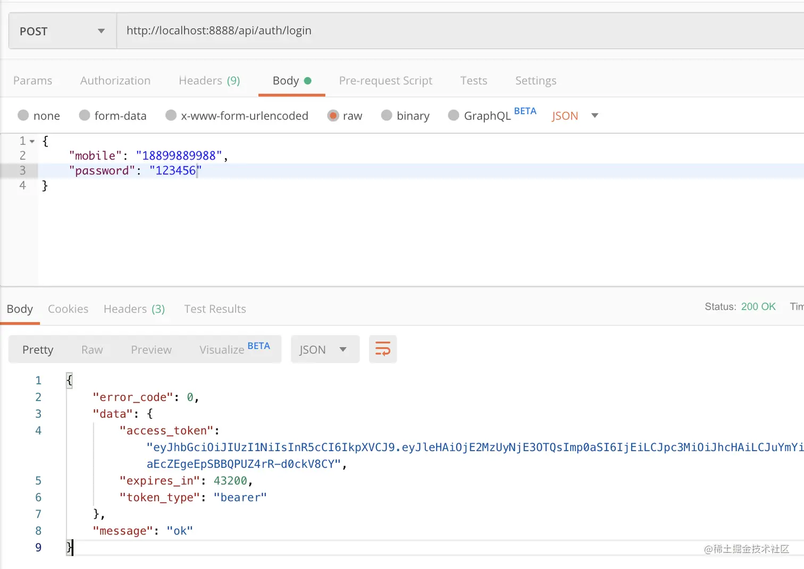
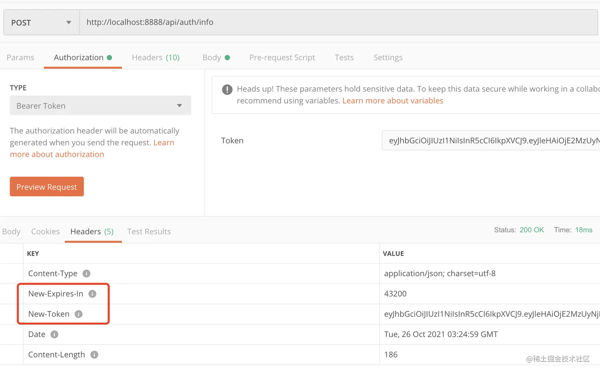

# 第十三章  - 从零封装属于自己的 Gin 框架 - Token 续签 & 封装分布式锁

学习资料参考：[手把手，带你从零封装Gin框架](https://juejin.cn/post/7018519894828253220)

**如果将 token 的有效期时间设置过短，到期后用户需要重新登录，过于繁琐且体验感差，这里我将采用服务端刷新 token 的方式来处理。**

1. 先规定一个时间点，比如在过期前的 2 小时内，如果用户访问了接口，就颁发新的 token 给客户端（设置响应头），同时把旧 token 加入黑名单
   + 设置一个黑名单宽限时间，目的就是避免并发请求中，刷新了 token ，导致部分请求失败的情况；
2. **同时，我们也要避免并发请求导致 token 重复刷新的情况，这时候就需要上锁了**
   + 主要目的是防止一个最新的 token 被旧的 token 覆，只能有一个请求更改完成，其他请求直接打回要求使用最新的 token
   + 这里使用了 Redis 分布式锁来实现，考虑到以后项目中可能会频繁使用锁，在篇头将简单做个封装


### 13.1 分布式锁的加锁解锁实现

在分布式系统中，使用 **Redis** 来实现分布式锁是一种常见的方式。分布式锁的目的是确保在多个客户端或服务实例中，只有一个客户端可以访问某个共享资源。

下面是使用 **Redis** 实现分布式锁的一个基本实现，分为加锁和解锁两个操作。

**加锁（SetNX）**

Redis 提供了一个名为 `SETNX`（SET if Not eXists）的命令，可以用来设置一个键的值，但只有当这个键不存在时才会成功设置。这可以用来实现加锁操作。

1. **加锁步骤**：

- **设置锁键**：使用 `SETNX` 设置一个锁键，表示要获取锁。如果键不存在，`SETNX` 会返回 `1`，表示加锁成功。
- **设置过期时间**：为了防止死锁，需要给锁设置一个过期时间。可以使用 `SET` 命令的 `EX` 或 `PX` 参数，或者通过 `SETNX` 后再通过 `EXPIRE` 设置过期时间。
- **防止锁泄漏**：使用合适的过期时间，确保即使加锁方崩溃或网络问题，锁也不会永久存在。

```go
// 加锁函数
func acquireLock(lockKey, value string, expireTime time.Duration) bool {
	// 使用 SETNX 命令尝试获取锁
	result, err := rdb.SetNX(ctx, lockKey, value, expireTime).Result()
	if err != nil {
		fmt.Println("Error acquiring lock:", err)
		return false
	}
	return result
}
```

**解释**：

- `SetNX` 是 `SET if Not Exists`，只有当 `lockKey` 键不存在时才会设置成功（即加锁成功）。
- `expireTime` 设置锁的过期时间，以防止死锁。

**解锁（DEL）**

解锁操作通过删除 Redis 中的锁键来释放锁。为了避免误解锁（比如删除了其他客户端设置的锁），我们需要确保只有加锁者才能解锁。可以通过 **设置锁时带上标识符（如 UUID）** 来实现这一点。

2. **解锁步骤**：

- 在加锁时生成一个唯一的标识符（如 UUID），并将其作为锁的值存储。
- 在解锁时，首先判断锁的值是否为当前标识符，如果是，则可以解锁。


### 13.2 封装分布式锁

新建 `utils/str.go` ，编写 `RandString()` 用于生成锁标识，防止任何客户端都能解锁

```go
import (
    "math/rand"
    "time"
)

func RandString(len int) string {
    r := rand.New(rand.NewSource(time.Now().UnixNano()))
    bytes := make([]byte, len)
    for i := 0; i < len; i++ {
        b := r.Intn(26) + 65
        bytes[i] = byte(b)
    }
    return string(bytes)
}
```

新建 `global/lock.go` ，编写

```go
import (
    "context"
    "github.com/go-redis/redis/v8"
    "jassue-gin/utils"
    "time"
)

type Interface interface {
    Get() bool
    Block(seconds int64) bool
    Release() bool
    ForceRelease()
}

type lock struct {
    context context.Context
    name string // 锁名称
    owner string // 锁标识
    seconds int64 // 有效期
}

// 释放锁 Lua 脚本，防止任何客户端都能解锁
const releaseLockLuaScript = `
if redis.call("get",KEYS[1]) == ARGV[1] then
    return redis.call("del",KEYS[1])
else
    return 0
end
`

// 生成锁
func Lock(name string, seconds int64) Interface {
    return &lock{
        context.Background(),
        name,
        utils.RandString(16),
        seconds,
    }
}

// 获取锁
func (l *lock) Get() bool {
    return App.Redis.SetNX(l.context, l.name, l.owner, time.Duration(l.seconds)*time.Second).Val()
}

// 阻塞一段时间，尝试获取锁
func (l *lock) Block(seconds int64) bool {
    starting := time.Now().Unix()
    for {
        if !l.Get() {
            time.Sleep(time.Duration(1) * time.Second)
            if time.Now().Unix()-seconds >= starting {
                return false
            }
        } else {
            return true
        }
    }
}

// 释放锁
func (l *lock) Release() bool {
    luaScript := redis.NewScript(releaseLockLuaScript)
    result := luaScript.Run(l.context, App.Redis, []string{l.name}, l.owner).Val().(int64)
    return result != 0
}

// 强制释放锁
func (l *lock) ForceRelease() {
    App.Redis.Del(l.context, l.name).Val()
}
```


### 13.3 定义配置项

在 `config/jwt.go` 中，增加 `RefreshGracePeriod` 属性

```go
package config

type Jwt struct {
    Secret string `mapstructure:"secret" json:"secret" yaml:"secret"`
    JwtTtl int64 `mapstructure:"jwt_ttl" json:"jwt_ttl" yaml:"jwt_ttl"` // token 有效期（秒）
    JwtBlacklistGracePeriod int64 `mapstructure:"jwt_blacklist_grace_period" json:"jwt_blacklist_grace_period" yaml:"jwt_blacklist_grace_period"` // 黑名单宽限时间（秒）
    RefreshGracePeriod int64 `mapstructure:"refresh_grace_period" json:"refresh_grace_period" yaml:"refresh_grace_period"` // token 自动刷新宽限时间（秒）
}
```

`config.yaml` 添加对应配置

```yaml
jwt:
  refresh_grace_period: 1800
```


### 13.4 JWT 中间件中增加续签机制

在 `app/services/jwt.go` 中，编写 `GetUserInfo()`， 根据不同客户端 token ，查询不同用户表数据

```go
func (jwtService *jwtService) GetUserInfo(GuardName string, id string) (err error, user JwtUser) {
    switch GuardName {
    case AppGuardName:
        return UserService.GetUserInfo(id)
    default:
        err = errors.New("guard " + GuardName +" does not exist")
    }
    return
}
```

在 `app/middleware/jwt.go` 中，编写

```go
package middleware

import (
    "github.com/dgrijalva/jwt-go"
    "github.com/gin-gonic/gin"
    "jassue-gin/app/common/response"
    "jassue-gin/app/services"
    "jassue-gin/global"
    "strconv"
    "time"
)

func JWTAuth(GuardName string) gin.HandlerFunc {
    return func(c *gin.Context) {
      
        //...
        claims := token.Claims.(*services.CustomClaims)
        if claims.Issuer != GuardName {
            response.TokenFail(c)
            c.Abort()
            return
        }

        // token 续签
        if claims.ExpiresAt-time.Now().Unix() < global.App.Config.Jwt.RefreshGracePeriod {
            lock := global.Lock("refresh_token_lock", global.App.Config.Jwt.JwtBlacklistGracePeriod)
            if lock.Get() {
                err, user := services.JwtService.GetUserInfo(GuardName, claims.Id)
                if err != nil {
                    global.App.Log.Error(err.Error())
                    lock.Release()
                } else {
                    tokenData, _, _ := services.JwtService.CreateToken(GuardName, user)
                    c.Header("new-token", tokenData.AccessToken)
                    c.Header("new-expires-in", strconv.Itoa(tokenData.ExpiresIn))
                    _ = services.JwtService.JoinBlackList(token)
                }
            }
        }

        c.Set("token", token)
        c.Set("id", claims.Id)
    }
}
```


### 13.5 测试

修改 `config.yaml` 配置，暂时将 `refresh_grace_period` 设置一个较大的值，确保能满足续签条件

```yaml
jwt:
  secret: 3Bde3BGEbYqtqyEUzW3ry8jKFcaPH17fRmTmqE7MDr05Lwj95uruRKrrkb44TJ4s
  jwt_ttl: 43200
  jwt_blacklist_grace_period: 10
  refresh_grace_period: 43200
```

调用 [http://localhost:8888/api/auth/login](https://link.juejin.cn?target=http%3A%2F%2Flocalhost%3A8888%2Fapi%2Fauth%2Flogin) ，获取 token



添加 token 到请求头，调用 [http://localhost:8888/api/auth/info](https://link.juejin.cn?target=http%3A%2F%2Flocalhost%3A8888%2Fapi%2Fauth%2Finfo) ，查看响应头，`New-Token` 为新 token，`New-Expires-In` 为新 token 的有效期



