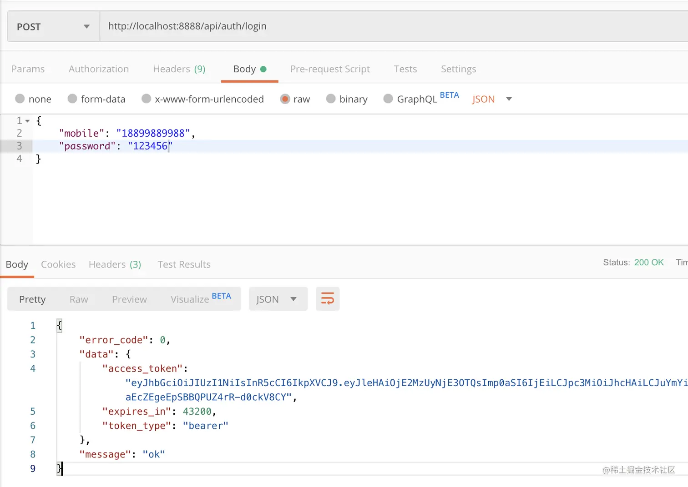
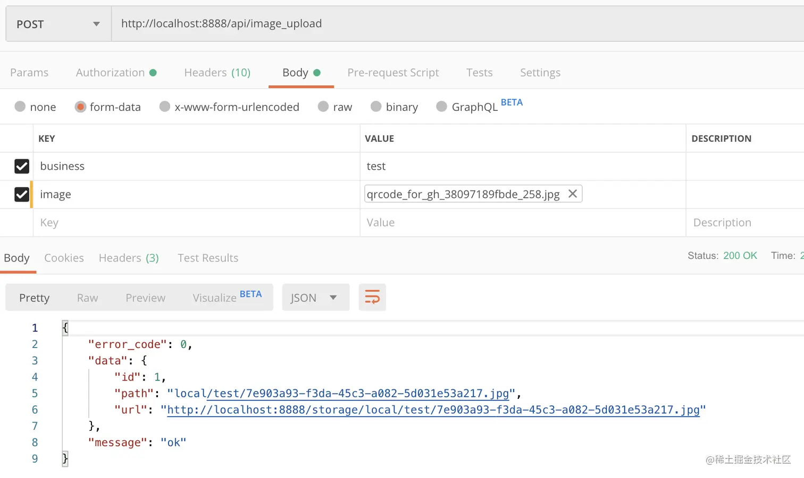

# 第十四章  - 从零封装属于自己的 Gin 框架 - 初始化多驱动文件系统 & 实现图片上传接口

学习资料参考：[手把手，带你从零封装Gin框架](https://juejin.cn/post/7018519894828253220)

在项目中有时会需要用到不同驱动的文件系统，为了简化不同驱动间的操作，需要将操作 API 统一，本项目简单封装了 [go-storage](https://link.juejin.cn?target=https%3A%2F%2Fgithub.com%2Fjassue%2Fgo-storage) 包，支持的驱动有本地存储、七牛云存储（kodo）、阿里云存储（oss），也支持自定义储存，该包代码比较简单。

**这里不过多赘述，本篇主要讲的如何在 Gin 框架中集成并使用它**

首先安装：

```go
go get -u github.com/jassue/go-storage
```


### 14.1 定义配置项

新建 `config/storage.go`，定义各个驱动的配置项

```go
package config

import (
    "github.com/jassue/go-storage/kodo"
    "github.com/jassue/go-storage/local"
    "github.com/jassue/go-storage/oss"
    "github.com/jassue/go-storage/storage"
)

type Storage struct {
    Default storage.DiskName `mapstructure:"default" json:"default" yaml:"default"` // local本地 oss阿里云 kodo七牛云
    Disks Disks `mapstructure:"disks" json:"disks" yaml:"disks"`
}

type Disks struct {
    Local local.Config `mapstructure:"local" json:"local" yaml:"local"`
    AliOss oss.Config `mapstructure:"ali_oss" json:"ali_oss" yaml:"ali_oss"`
    QiNiu kodo.Config `mapstructure:"qi_niu" json:"qi_niu" yaml:"qi_niu"`
}
```

`config/config.go` 添加 `Storage` 成员属性

```go
package config

type Configuration struct {
    App App `mapstructure:"app" json:"app" yaml:"app"`
    Log Log `mapstructure:"log" json:"log" yaml:"log"`
    Database Database `mapstructure:"database" json:"database" yaml:"database"`
    Jwt Jwt `mapstructure:"jwt" json:"jwt" yaml:"jwt"`
    Redis Redis `mapstructure:"redis" json:"redis" yaml:"redis"`
    Storage Storage `mapstructure:"storage" json:"storage" yaml:"storage"`
}
```

`config.yaml` 添加对应配置

```yaml
storage:
  default: local # 默认驱动
  disks:
    local:
      root_dir: ./storage/app # 本地存储根目录
      app_url: http://localhost:8888/storage # 本地图片 url 前部
    ali_oss:
      access_key_id:
      access_key_secret:
      bucket:
      endpoint:
      is_ssl: true # 是否使用 https 协议
      is_private: false # 是否私有读
    qi_niu:
      access_key:
      bucket:
      domain:
      secret_key:
      is_ssl: true
      is_private: false
```


### 14.2 初始化 Storage

新建 `bootstrap/storage.go` 文件，编写：

```go
package bootstrap

import (
    "github.com/jassue/go-storage/kodo"
    "github.com/jassue/go-storage/local"
    "github.com/jassue/go-storage/oss"
    "jassue-gin/global"
)

func InitializeStorage() {
    _, _ = local.Init(global.App.Config.Storage.Disks.Local)
    _, _ = kodo.Init(global.App.Config.Storage.Disks.QiNiu)
    _, _ = oss.Init(global.App.Config.Storage.Disks.AliOss)
}
```

在 `global/app.go` 中，为 `Application` 结构体添加成员方法 `Disk()` ，作为获取文件系统实例的统一入口

```go
package global

import (
    "github.com/go-redis/redis/v8"
    "github.com/jassue/go-storage/storage"
    "github.com/spf13/viper"
    "go.uber.org/zap"
    "gorm.io/gorm"
    "jassue-gin/config"
)

type Application struct {
    ConfigViper *viper.Viper
    Config config.Configuration
    Log *zap.Logger
    DB *gorm.DB
    Redis *redis.Client
}

var App = new(Application)

func (app *Application) Disk(disk... string) storage.Storage {
    // 若未传参，默认使用配置文件驱动
    diskName := app.Config.Storage.Default
    if len(disk) > 0 {
        diskName = storage.DiskName(disk[0])
    }
    s, err := storage.Disk(diskName)
    if err != nil {
        panic(err)
    }
    return s
}
```

在 `main.go` 中调用

```go
package main

import (
    "jassue-gin/bootstrap"
    "jassue-gin/global"
)

func main() {
    // ...

    // 初始化Redis
    global.App.Redis = bootstrap.InitializeRedis()

    // 初始化文件系统
    bootstrap.InitializeStorage()

    // 启动服务器
    bootstrap.RunServer()
}
```


### 14.3 实现图片上传接口

为了统一管理文件的 url，我这里将把 url 存到 mysql 中

新建 `app/models/media.go` 模型文件

```go
package models

type Media struct {
    ID
    DiskType string `json:"disk_type" gorm:"size:20;index;not null;comment:存储类型"`
    SrcType int8 `json:"src_type" gorm:"not null;comment:链接类型 1相对路径 2外链"`
    Src string `json:"src" gorm:"not null;comment:资源链接"`
    Timestamps
}
```

在 `bootstrap/db.go` 中，初始化 `media` 数据表

```go
func initMySqlTables(db *gorm.DB) {
    err := db.AutoMigrate(
        models.User{},
        models.Media{},
    )
    if err != nil {
        global.App.Log.Error("migrate table failed", zap.Any("err", err))
        os.Exit(0)
    }
}
```

新建 `app/common/request/upload.go` 文件，编写表单验证器

```go
package request

import "mime/multipart"

type ImageUpload struct {
    Business string `form:"business" json:"business" binding:"required"`
    Image *multipart.FileHeader `form:"image" json:"image" binding:"required"`
}

func (imageUpload ImageUpload) GetMessages() ValidatorMessages {
    return ValidatorMessages{
        "business.required": "业务类型不能为空",
        "image.required": "请选择图片",
    }
}
```

新建 `app/services/media.go` 文件，编写图片上传相关逻辑

```go
package services

import (
    "context"
    "errors"
    "github.com/jassue/go-storage/storage"
    "github.com/satori/go.uuid"
    "jassue-gin/app/common/request"
    "jassue-gin/app/models"
    "jassue-gin/global"
    "path"
    "strconv"
    "time"
)

type mediaService struct {
}

var MediaService = new(mediaService)

type outPut struct {
    Id int64 `json:"id"`
    Path string `json:"path"`
    Url string `json:"url"`
}

const mediaCacheKeyPre = "media:"

// 文件存储目录
func (mediaService *mediaService) makeFaceDir(business string) string {
    return global.App.Config.App.Env + "/" + business
}

// HashName 生成文件名称（使用 uuid）
func (mediaService *mediaService) HashName(fileName string) string {
    fileSuffix := path.Ext(fileName)
    return uuid.NewV4().String() + fileSuffix
}

// SaveImage 保存图片（公共读）
func (mediaService *mediaService) SaveImage(params request.ImageUpload) (result outPut, err error) {
    file, err := params.Image.Open()
    defer file.Close()
    if err != nil {
        err = errors.New("上传失败")
        return
    }

    localPrefix := ""
    // 本地文件存放路径为 storage/app/public，由于在『（五）静态资源处理 & 优雅重启服务器』中，
    // 配置了静态资源处理路由 router.Static("/storage", "./storage/app/public")
    // 所以此处不需要将 public/ 存入到 mysql 中，防止后续拼接文件 Url 错误
    if global.App.Config.Storage.Default == storage.Local {
        localPrefix = "public" + "/"
    }
    key := mediaService.makeFaceDir(params.Business) + "/" + mediaService.HashName(params.Image.Filename)
    disk := global.App.Disk()
    err = disk.Put(localPrefix + key, file, params.Image.Size)
    if err != nil {
        return
    }

    image := models.Media{
        DiskType: string(global.App.Config.Storage.Default),
        SrcType:    1,
        Src:        key,
    }
    err = global.App.DB.Create(&image).Error
    if err != nil {
        return
    }

    result = outPut{int64(image.ID.ID), key, disk.Url(key)}
    return
}

// GetUrlById 通过 id 获取文件 url
func (mediaService *mediaService) GetUrlById(id int64) string {
    if id == 0 {
        return ""
    }

    var url string
    cacheKey := mediaCacheKeyPre + strconv.FormatInt(id,10)

    exist := global.App.Redis.Exists(context.Background(), cacheKey).Val()
    if exist == 1 {
        url = global.App.Redis.Get(context.Background(), cacheKey).Val()
    } else {
        media := models.Media{}
        err := global.App.DB.First(&media, id).Error
        if err != nil {
            return ""
        }
        url = global.App.Disk(media.DiskType).Url(media.Src)
        global.App.Redis.Set(context.Background(), cacheKey, url, time.Second*3*24*3600)
    }

    return url
}
```

新建 `app/controllers/common/upload.go` 文件，校验入参，调用 `MediaService`

```go
package common

import (
    "github.com/gin-gonic/gin"
    "jassue-gin/app/common/request"
    "jassue-gin/app/common/response"
    "jassue-gin/app/services"
)

func ImageUpload(c *gin.Context) {
    var form request.ImageUpload
    if err := c.ShouldBind(&form); err != nil {
        response.ValidateFail(c, request.GetErrorMsg(form, err))
        return
    }

    outPut, err := services.MediaService.SaveImage(form)
    if err != nil {
        response.BusinessFail(c, err.Error())
        return
    }
    response.Success(c, outPut)
}
```

在 `routes/api.go` 文件添加路由

```go
package routes

import (
    "github.com/gin-gonic/gin"
    "jassue-gin/app/controllers/app"
    "jassue-gin/app/controllers/common"
    "jassue-gin/app/middleware"
    "jassue-gin/app/services"
)

func SetApiGroupRoutes(router *gin.RouterGroup) {
    // ...
    authRouter := router.Group("").Use(middleware.JWTAuth(services.AppGuardName))
    {
        authRouter.POST("/auth/info", app.Info)
        authRouter.POST("/auth/logout", app.Logout)
        authRouter.POST("/image_upload", common.ImageUpload)
    }
}
```


### 14.4 测试

调用 [http://localhost:8888/api/auth/login](https://link.juejin.cn?target=http%3A%2F%2Flocalhost%3A8888%2Fapi%2Fauth%2Flogin) ，获取 token



添加 token 到请求头，调用 [http://localhost:8888/api/image_upload](https://link.juejin.cn?target=http%3A%2F%2Flocalhost%3A8888%2Fapi%2Fimage_upload) ，上传成功



修改 `config.yaml` 默认驱动配置项，依次修改为本地，并同时调用接口，如下图，文件都成功上传了


