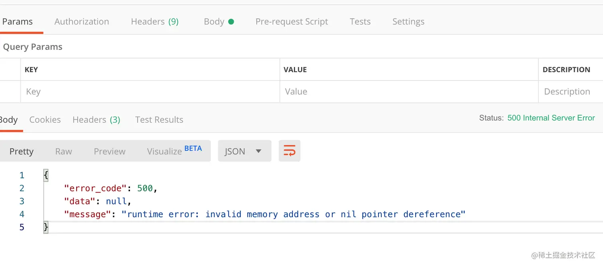

# 第十五章  - 从零封装属于自己的 Gin 框架 - 使用文件记录错误日志 & 跨域处理

学习资料参考：[手把手，带你从零封装Gin框架](https://juejin.cn/post/7018519894828253220)

**为什么要使用文件记录错误日志：**

+ Gin 框架的日志默认是在控制台输出，本篇将使用 Gin 提供的 `RecoveryWithWriter()` 方法，封装一个中间件，使用 `lumberjack` 作为的写入器，将错误日志写入文件中；

**跨域处理：**

+ 同时，本篇使用 `github.com/gin-contrib/cors` ，作下跨域处理。

安装：

```
go get -u gopkg.in/natefinch/lumberjack.v2
go get github.com/gin-contrib/cors
```


### 15.1 文件记录 - Recovery 中间件

在 `app/common/response/response.go` 文件中，添加 `ServerError()` 方法，作为 `RecoveryFunc`

```go
package response

import (
    "github.com/gin-gonic/gin"
    "jassue-gin/global"
    "net/http"
    "os"
)

// ...

func ServerError(c *gin.Context, err interface{}) {
    msg := "Internal Server Error"
    // 非生产环境显示具体错误信息
    if global.App.Config.App.Env != "production" && os.Getenv(gin.EnvGinMode) != gin.ReleaseMode {
        if _, ok := err.(error); ok {
            msg = err.(error).Error()
        }
    }
    c.JSON(http.StatusInternalServerError, Response{
        http.StatusInternalServerError,
        nil,
        msg,
    })
    c.Abort()
}
// ...
```

新建 `app/middleware/recovery.go` 文件，编写：

```go
package middleware

import (
    "github.com/gin-gonic/gin"
    "gopkg.in/natefinch/lumberjack.v2"
    "jassue-gin/app/common/response"
    "jassue-gin/global"
)

func CustomRecovery() gin.HandlerFunc {
    return gin.RecoveryWithWriter(
        &lumberjack.Logger{
            Filename:   global.App.Config.Log.RootDir + "/" + global.App.Config.Log.Filename,
            MaxSize:    global.App.Config.Log.MaxSize,
            MaxBackups: global.App.Config.Log.MaxBackups,
            MaxAge:     global.App.Config.Log.MaxAge,
            Compress:   global.App.Config.Log.Compress,
        },
        response.ServerError)
}
```


### 15.2 跨域处理介绍

跨域处理主要是为了应对浏览器的同源策略（Same-Origin Policy），它是浏览器的一种安全机制，限制了不同源（**协议、域名、端口不同**）之间的互相访问。虽然这个机制可以保护用户免受恶意攻击，但也会导致一些需要跨源访问的情况无法顺利进行，比如：

1. **不同域名的资源访问**：例如，一个网页可能需要访问另一个域名上的API或获取第三方的资源，但浏览器会阻止这种访问，除非目标服务器显式允许。
2. **前后端分离架构**：在现代Web开发中，前端和后端通常分布在不同的域上，前端需要通过API与后端进行通信，跨域处理使得这种通信成为可能。
3. **第三方服务集成**：很多应用需要集成外部服务，比如支付平台、地图服务等，这些服务通常会部署在不同的域上，也需要进行跨域访问。

**跨域处理的常见方法：**

- **CORS（跨源资源共享）**：允许服务器指定哪些来源（域、协议、端口）可以访问其资源。通过在HTTP响应头中设置特定的字段（如`Access-Control-Allow-Origin`）来实现。
- **JSONP**：通过动态创建`<script>`标签的方式来绕过同源策略，适用于GET请求。
- **代理服务器**：通过在服务器端设置代理，将跨域请求转发到目标服务器，浏览器只与代理服务器交互。
- **WebSockets**：支持跨域的实时双向通信，不受同源策略的限制。

总之，跨域处理使得在不同域之间的通信变得可能，从而支持更复杂和灵活的Web应用。


### 15.3 跨域处理实践与使用中间件

新建 `app/middleware/cors.go` 文件，编写：

```go
package middleware

import (
    "github.com/gin-contrib/cors"
    "github.com/gin-gonic/gin"
)

func Cors() gin.HandlerFunc {
    config := cors.DefaultConfig()
    config.AllowAllOrigins = true
    config.AllowHeaders = []string{"Origin", "Content-Length", "Content-Type", "Authorization"}
    config.AllowCredentials = true
    config.ExposeHeaders = []string{"New-Token", "New-Expires-In", "Content-Disposition"}

    return cors.New(config)
}
```

这段代码是使用 `Gin` 框架中的 `cors` 中间件来处理跨域请求。它配置了 CORS（跨源资源共享）策略，允许浏览器从不同的源（域）访问当前服务的资源。让我们详细解读一下每一部分的作用：

1. **`config := cors.DefaultConfig()`**
   - 这是创建一个 `cors` 配置对象，`DefaultConfig()` 是 `cors` 中间件提供的一个默认配置，默认情况下，跨域访问会被限制。
2. **`config.AllowAllOrigins = true`**
   - 这行代码设置允许所有的源（域）访问当前服务器的资源。`true` 表示任何源都可以进行跨域请求。如果想限制某些特定的域，可以将其设置为一个字符串数组，例如 `config.AllowOrigins = []string{"http://example.com", "http://another-domain.com"}`。
3. **`config.AllowHeaders = []string{"Origin", "Content-Length", "Content-Type", "Authorization"}`**
   - 这行代码指定了允许客户端在请求头中携带的字段。这些字段是跨域请求中可能会使用到的常见 HTTP 头部。比如：
     - `Origin`：表示请求的源。
     - `Content-Length`：请求内容的长度。
     - `Content-Type`：请求内容的类型。
     - `Authorization`：通常用于携带身份验证信息。
4. **`config.AllowCredentials = true`**
   - 设置此项为 `true` 表示允许浏览器携带凭证（如 cookies 或 HTTP 身份验证信息）进行跨域请求。默认情况下，跨域请求不会发送 cookies，只有当这个选项被设置为 `true` 时，才能正常发送和接收凭证。
5. **`config.ExposeHeaders = []string{"New-Token", "New-Expires-In", "Content-Disposition"}`**
   - 这行代码指定了允许浏览器访问的响应头部信息。跨域请求时，浏览器默认只允许访问 `Cache-Control`、`Content-Language`、`Content-Type`、`Expires` 和 `Last-Modified` 等少数几个响应头。为了访问其他头部（如 `New-Token`、`New-Expires-In` 等），需要显式声明。
6. **`return cors.New(config)`**
   - 最后，这行代码通过 `cors.New(config)` 创建一个新的 CORS 中间件，并返回给 Gin 框架。**这个中间件会根据上面的配置来处理跨域请求。**

------


### 15.4 添加中间件

在 `bootstrap/router.go` 文件，编写：

```go
func setupRouter() *gin.Engine {
    if global.App.Config.App.Env == "production" {
        gin.SetMode(gin.ReleaseMode)
    }
    router := gin.New()
    router.Use(gin.Logger(), middleware.CustomRecovery())

    // 跨域处理
    // router.Use(middleware.Cors())

    // ...
}
```


### 15.5 测试

为了演示，这里我故意将数据库配置写错，请求登录接口，中间件成功生效

接着查看 `storage/logs/app.log` 文件，错误信息成功写入到文件，内容如下：

```bash
[31m2021/11/21 20:40:18 [Recovery] 2021/11/21 - 20:40:18 panic recovered:
POST /api/auth/login HTTP/1.1
Host: localhost:8888
Accept: */*
Accept-Encoding: gzip, deflate
Cache-Control: no-cache
Connection: keep-alive
Content-Length: 51
Content-Type: application/json
Postman-Token: 30136d3a-9a7d-43ff-bd6e-8f408dd20a7e
User-Agent: PostmanRuntime/7.18.0


runtime error: invalid memory address or nil pointer dereference
/usr/local/go/src/runtime/panic.go:221 (0x104a9c6)
	panicmem: panic(memoryError)
/usr/local/go/src/runtime/signal_unix.go:735 (0x104a996)
	sigpanic: panicmem()
/Users/sjj/go/pkg/mod/gorm.io/gorm@v1.21.16/gorm.go:355 (0x1537ed8)
	(*DB).getInstance: if db.clone > 0 {
/Users/sjj/go/pkg/mod/gorm.io/gorm@v1.21.16/chainable_api.go:146 (0x152efdb)
	(*DB).Where: tx = db.getInstance()
/Users/sjj/go/src/jassue-gin/app/services/user.go:31 (0x17a963e)
	(*userService).Login: err = global.App.DB.Where("mobile = ?", params.Mobile).First(&user).Error
/Users/sjj/go/src/jassue-gin/app/controllers/app/auth.go:37 (0x17aab7b)
	Login: if err, user := services.UserService.Login(form); err != nil {
/Users/sjj/go/pkg/mod/github.com/gin-gonic/gin@v1.7.4/context.go:165 (0x1797681)
	(*Context).Next: c.handlers[c.index](c)
/Users/sjj/go/pkg/mod/github.com/gin-gonic/gin@v1.7.4/recovery.go:99 (0x179766c)
	CustomRecoveryWithWriter.func1: c.Next()
/Users/sjj/go/pkg/mod/github.com/gin-gonic/gin@v1.7.4/context.go:165 (0x17968e6)
	(*Context).Next: c.handlers[c.index](c)
/Users/sjj/go/pkg/mod/github.com/gin-gonic/gin@v1.7.4/logger.go:241 (0x17968c9)
	LoggerWithConfig.func1: c.Next()
/Users/sjj/go/pkg/mod/github.com/gin-gonic/gin@v1.7.4/context.go:165 (0x1795e1d)
	(*Context).Next: c.handlers[c.index](c)
/Users/sjj/go/pkg/mod/github.com/gin-gonic/gin@v1.7.4/gin.go:489 (0x1795aa5)
	(*Engine).handleHTTPRequest: c.Next()
/Users/sjj/go/pkg/mod/github.com/gin-gonic/gin@v1.7.4/gin.go:445 (0x1795604)
	(*Engine).ServeHTTP: engine.handleHTTPRequest(c)
/usr/local/go/src/net/http/server.go:2878 (0x129e49a)
	serverHandler.ServeHTTP: handler.ServeHTTP(rw, req)
/usr/local/go/src/net/http/server.go:1929 (0x1299b47)
	(*conn).serve: serverHandler{c.server}.ServeHTTP(w, w.req)
/usr/local/go/src/runtime/asm_amd64.s:1581 (0x1065ac0)
	goexit: BYTE	$0x90	// NOP
[0m
```