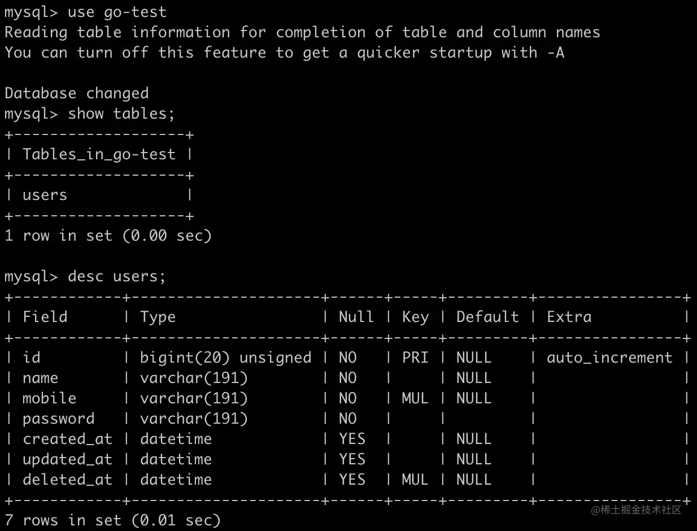

# 第八章 Gin 进阶 - 从零封装属于自己的 Gin 框架 - 数据库初始化(GORM) 

学习资料参考：[手把手，带你从零封装Gin框架](https://juejin.cn/post/7018519894828253220)

### 8.1 Gorm

GORM 是一个流行的 Go 语言 ORM（对象关系映射）库，它的作用是简化 Go 应用程序与数据库之间的交互。

+ 通过 GORM，你可以**像操作普通 Go 结构体一样操作数据库中的数据** ，而不需要写大量的 SQL 语句。

+ GORM 自动将结构体映射到数据库表，并提供了很多方便的功能来处理数据库操作。

更多内容查看[官方文档](https://link.juejin.cn?target=https%3A%2F%2Fgorm.io%2Fdocs%2F)。

**Gorm 安装：**

```go
go get -u gorm.io/gorm

# GORM 官方支持 sqlite、mysql、postgres、sqlserver
go get -u gorm.io/driver/mysql 
```

具体来说，GORM 的作用包括：

1. **简化数据库操作**：你可以通过 Go 的结构体和方法直接操作数据库，避免了手写 SQL 语句的复杂性。
2. **模型与数据库表的映射**：GORM 将 Go 结构体映射到数据库中的表，结构体字段映射为表中的列。GORM 会根据结构体的定义自动生成 SQL 查询。
3. **CRUD 操作**：支持创建（Create）、读取（Read）、更新（Update）和删除（Delete）操作（即标准的数据库操作）。
4. **自动迁移**：GORM 可以根据结构体定义自动创建或更新数据库表结构。
5. **查询构建器**：提供了链式查询构建器，可以方便地进行复杂的查询。
6. **事务支持**：GORM 支持事务处理，确保多个操作可以在同一事务中执行，保证数据的一致性。
7. **支持多种数据库**：支持 MySQL、PostgreSQL、SQLite、SQL Server 等多种关系型数据库。

总的来说，GORM 使得开发者可以更方便、直观地与数据库交互，特别适合 Go 语言的 Web 开发或其他数据库驱动的应用。


### 8.2 实践过程

#### 8.2.1 定义配置项

新建 `config/database.go` 文件，自定义配置项

```go
package config

type Database struct {
    Driver string `mapstructure:"driver" json:"driver" yaml:"driver"`
    Host string `mapstructure:"host" json:"host" yaml:"host"`
    Port int `mapstructure:"port" json:"port" yaml:"port"`
    Database string `mapstructure:"database" json:"database" yaml:"database"`
    UserName string `mapstructure:"username" json:"username" yaml:"username"`
    Password string `mapstructure:"password" json:"password" yaml:"password"`
    Charset string `mapstructure:"charset" json:"charset" yaml:"charset"`
    MaxIdleConns int `mapstructure:"max_idle_conns" json:"max_idle_conns" yaml:"max_idle_conns"`
    MaxOpenConns int `mapstructure:"max_open_conns" json:"max_open_conns" yaml:"max_open_conns"`
    LogMode string `mapstructure:"log_mode" json:"log_mode" yaml:"log_mode"`
    EnableFileLogWriter bool `mapstructure:"enable_file_log_writer" json:"enable_file_log_writer" yaml:"enable_file_log_writer"`
    LogFilename string `mapstructure:"log_filename" json:"log_filename" yaml:"log_filename"`
}
```

`config/config.go` 添加 `Database` 成员属性

```go
package config

type Configuration struct {
    App App `mapstructure:"app" json:"app" yaml:"app"`
    Log Log `mapstructure:"log" json:"log" yaml:"log"`
    Database Database `mapstructure:"database" json:"database" yaml:"database"`
}
```

`config.yaml` 增加对应配置项

```yaml
database:
  driver: mysql # 数据库驱动
  host: 127.0.0.1 # 域名
  port: 8306 # 端口号
  database: go-test # 数据库名称
  username: root # 用户名
  password: root # 密码
  charset: utf8mb4 # 编码格式
  max_idle_conns: 10 # 空闲连接池中连接的最大数量
  max_open_conns: 100 # 打开数据库连接的最大数量
  log_mode: info # 日志级别
  enable_file_log_writer: true # 是否启用日志文件
  log_filename: sql.log # 日志文件名称
```


#### 8.2.2 自定义 Logger（使用文件记录日志）

`gorm` 有一个默认的 [logger](https://link.juejin.cn?target=https%3A%2F%2Fgithub.com%2Fgo-gorm%2Fgorm%2Fblob%2Fmaster%2Flogger%2Flogger.go) ，由于日志内容是输出到控制台的，我们需要自定义一个写入器，将默认`logger.Writer` 接口的实现切换为自定义的写入器，上一篇引入了 `lumberjack` ，将继续使用它

**新建 `bootstrap/db.go` 文件，编写 `getGormLogWriter` 函数：**

```go
package bootstrap

import (
    "gopkg.in/natefinch/lumberjack.v2"
    "gorm.io/gorm/logger"
    "io"
    "jassue-gin/global"
    "log"
    "os"
)

// 自定义 gorm Writer
func getGormLogWriter() logger.Writer {
    var writer io.Writer
    
    // 是否启用日志文件
    if global.App.Config.Database.EnableFileLogWriter {
        // 自定义 Writer
        writer = &lumberjack.Logger{
            Filename:   global.App.Config.Log.RootDir + "/" + global.App.Config.Database.LogFilename,
            MaxSize:    global.App.Config.Log.MaxSize,
            MaxBackups: global.App.Config.Log.MaxBackups,
            MaxAge:     global.App.Config.Log.MaxAge,
            Compress:   global.App.Config.Log.Compress,
        }
    } else {
        // 默认 Writer
        writer = os.Stdout
    }
    return log.New(writer, "\r\n", log.LstdFlags)
}
```

接下来，编写 `getGormLogger` 函数， 切换默认 `Logger` 使用的 `Writer`

```go
func getGormLogger() logger.Interface {
    var logMode logger.LogLevel

    switch global.App.Config.Database.LogMode {
    case "silent":
        logMode = logger.Silent
    case "error":
        logMode = logger.Error
    case "warn":
        logMode = logger.Warn
    case "info":
        logMode = logger.Info
    default:
        logMode = logger.Info
    }

    return logger.New(getGormLogWriter(), logger.Config{
        SlowThreshold:             200 * time.Millisecond, // 慢 SQL 阈值
        LogLevel:                  logMode, // 日志级别
        IgnoreRecordNotFoundError: false, // 忽略ErrRecordNotFound（记录未找到）错误
        Colorful:                  !global.App.Config.Database.EnableFileLogWriter, // 禁用彩色打印
    })
}

```

**至此，自定义 Logger 就已经实现了，这里只简单替换了 `logger.Writer` 的实现，大家可以根据各自的需求做其它定制化配置**


#### 8.2.3 初始化数据库

在 `bootstrap/db.go` 文件中，编写 `InitializeDB` 初始化数据库函数，以便于在 `main.go` 中调用

```go
package bootstrap

import (
    "gopkg.in/natefinch/lumberjack.v2"
    "gorm.io/driver/mysql"
    "gorm.io/gorm"
    "gorm.io/gorm/logger"
    "io"
    "jassue-gin/global"
    "log"
    "os"
    "strconv"
    "time"
)

func InitializeDB() *gorm.DB {
    // 根据驱动配置进行初始化
    switch global.App.Config.Database.Driver {
    case "mysql":
       return initMySqlGorm()
    default:
       return initMySqlGorm()
    }
}

// 初始化 mysql gorm.DB
func initMySqlGorm() *gorm.DB {
    dbConfig := global.App.Config.Database

    if dbConfig.Database == "" {
        return nil
    }
    dsn := dbConfig.UserName + ":" + dbConfig.Password + "@tcp(" + dbConfig.Host + ":" + strconv.Itoa(dbConfig.Port) + ")/" +
        dbConfig.Database + "?charset=" + dbConfig.Charset +"&parseTime=True&loc=Local"
    mysqlConfig := mysql.Config{
        DSN:                       dsn,   // DSN data source name
        DefaultStringSize:         191,   // string 类型字段的默认长度
        DisableDatetimePrecision:  true,  // 禁用 datetime 精度，MySQL 5.6 之前的数据库不支持
        DontSupportRenameIndex:    true,  // 重命名索引时采用删除并新建的方式，MySQL 5.7 之前的数据库和 MariaDB 不支持重命名索引
        DontSupportRenameColumn:   true,  // 用 `change` 重命名列，MySQL 8 之前的数据库和 MariaDB 不支持重命名列
        SkipInitializeWithVersion: false, // 根据版本自动配置
    }
    if db, err := gorm.Open(mysql.New(mysqlConfig), &gorm.Config{
        DisableForeignKeyConstraintWhenMigrating: true, // 禁用自动创建外键约束
        Logger: getGormLogger(), // 使用自定义 Logger
    }); err != nil {
        global.App.Log.Error("mysql connect failed, err:", zap.Any("err", err))
        return nil
    } else {
        sqlDB, _ := db.DB()
        sqlDB.SetMaxIdleConns(dbConfig.MaxIdleConns)
        sqlDB.SetMaxOpenConns(dbConfig.MaxOpenConns)
        return db
    }
}

func getGormLogger() logger.Interface {
    var logMode logger.LogLevel

    switch global.App.Config.Database.LogMode {
    case "silent":
        logMode = logger.Silent
    case "error":
        logMode = logger.Error
    case "warn":
        logMode = logger.Warn
    case "info":
        logMode = logger.Info
    default:
        logMode = logger.Info
    }

    return logger.New(getGormLogWriter(), logger.Config{
        SlowThreshold:             200 * time.Millisecond, // 慢 SQL 阈值
        LogLevel:                  logMode, // 日志级别
        IgnoreRecordNotFoundError: false, // 忽略ErrRecordNotFound（记录未找到）错误
        Colorful:                  !global.App.Config.Database.EnableFileLogWriter, // 禁用彩色打印
    })
}

// 自定义 gorm Writer
func getGormLogWriter() logger.Writer {
    var writer io.Writer

    // 是否启用日志文件
    if global.App.Config.Database.EnableFileLogWriter {
        // 自定义 Writer
        writer = &lumberjack.Logger{
            Filename:   global.App.Config.Log.RootDir + "/" + global.App.Config.Database.LogFilename,
            MaxSize:    global.App.Config.Log.MaxSize,
            MaxBackups: global.App.Config.Log.MaxBackups,
            MaxAge:     global.App.Config.Log.MaxAge,
            Compress:   global.App.Config.Log.Compress,
        }
    } else {
        // 默认 Writer
        writer = os.Stdout
    }
    return log.New(writer, "\r\n", log.LstdFlags)
}
```


#### 8.2.4 编写模型文件进行数据库迁移

新建 `app/models/common.go` 文件，定义公用模型字段

```go
package models

import (
    "gorm.io/gorm"
    "time"
)

// 自增ID主键
type ID struct {
    ID uint `json:"id" gorm:"primaryKey"`
}

// 创建、更新时间
type Timestamps struct {
    CreatedAt time.Time `json:"created_at"`
    UpdatedAt time.Time `json:"updated_at"`
}

// 软删除
type SoftDeletes struct {
    DeletedAt gorm.DeletedAt `json:"deleted_at" gorm:"index"`
}
```

新建 `app/models/user.go` 文件，定义 `User` 模型

```go
package models

type User struct {
    ID
    Name string `json:"name" gorm:"not null;comment:用户名称"`
    Mobile string `json:"mobile" gorm:"not null;index;comment:用户手机号"`
    Password string `json:"password" gorm:"not null;default:'';comment:用户密码"`
    Timestamps
    SoftDeletes
}
```

在 `bootstrap/db.go` 文件中，编写数据库表初始化代码

```go
func initMySqlGorm() *gorm.DB {
    // ...
    if db, err := gorm.Open(mysql.New(mysqlConfig), &gorm.Config{
        DisableForeignKeyConstraintWhenMigrating: true, // 禁用自动创建外键约束
        Logger: getGormLogger(), // 使用自定义 Logger
    }); err != nil {
        return nil
    } else {
        sqlDB, _ := db.DB()
        sqlDB.SetMaxIdleConns(dbConfig.MaxIdleConns)
        sqlDB.SetMaxOpenConns(dbConfig.MaxOpenConns)
        initMySqlTables(db)
        return db
    }
}

// 数据库表初始化
func initMySqlTables(db *gorm.DB) {
    err := db.AutoMigrate(
        models.User{},
    )
    if err != nil {
        global.App.Log.Error("migrate table failed", zap.Any("err", err))
        os.Exit(0)
    }
}
```


#### 8.2.5 定义全局变量DB

在 `global/app.go` 中，编写：

```go
package global

import (
    "github.com/spf13/viper"
    "go.uber.org/zap"
    "gorm.io/gorm"
    "jassue-gin/config"
)

type Application struct {
    ConfigViper *viper.Viper
    Config config.Configuration
    Log *zap.Logger
    DB *gorm.DB
}

var App = new(Application)
```


#### 8.2.6 测试

在 `main.go` 中调用数据库初始化函数

```go
package main

import (
    "github.com/gin-gonic/gin"
    "jassue-gin/bootstrap"
    "jassue-gin/global"
    "net/http"
)

func main() {
    // 初始化配置
    bootstrap.InitializeConfig()

    // 初始化日志
    global.App.Log = bootstrap.InitializeLog()
    global.App.Log.Info("log init success!")

    // 初始化数据库
    global.App.DB = bootstrap.InitializeDB()
    // 程序关闭前，释放数据库连接
    defer func() {
        if global.App.DB != nil {
            db, _ := global.App.DB.DB()
            db.Close()
        }
    }()

    r := gin.Default()

    // 测试路由
    r.GET("/ping", func(c *gin.Context) {
        c.String(http.StatusOK, "pong")
    })

    // 启动服务器
    r.Run(":" + global.App.Config.App.Port)
}
```

启动 `main.go` ，由于我还没有创建 `go-test` 数据库，并且调整了 `logger.Writer` 为 `lumberjack`，所以会生成 `storage/logs/sql.log` 文件，文件内容如下：

```go
2021/10/13 19:17:47 /Users/sujunjie/go/src/jassue-gin/bootstrap/db.go:44
[error] failed to initialize database, got error Error 1049: Unknown database 'go-test'
```

创建 `go-test` 数据库，重新启动 `main.go` ，`users` 表创建成功




#### 8.2.7 补充

上面的操作中，数据库表是自动生成数据库表的，假如我想要获取本地的数据库表并对其操作应该怎么做？

**回答：**

注释掉下面代码应该就可以了，AutoMigrate 方法的作用是确保代码中的结构体与数据库表结构保持同步

```go
// 数据库表初始化
func initMySqlTables(db *gorm.DB) {
    err := db.AutoMigrate(
        models.User{},
    )
    if err != nil {
        global.App.Log.Error("migrate table failed", zap.Any("err", err))
        os.Exit(0)
    }
}
```

