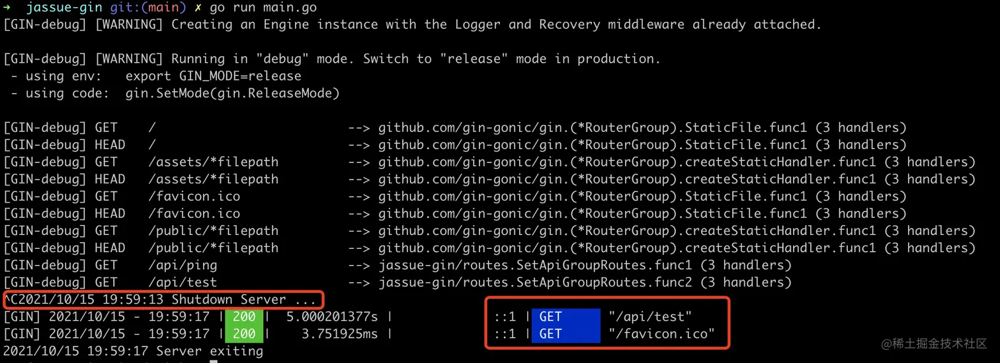

# 第九章 Gin 进阶 - 从零封装属于自己的 Gin 框架 - 静态资源处理 & 优雅重启服务器

学习资料参考：[手把手，带你从零封装Gin框架](https://juejin.cn/post/7018519894828253220)

## 9.1 静态资源处理

在 Gin 框架中，静态资源处理是指为 Web 应用程序提供直接访问静态文件（如图片、CSS、JavaScript 文件等）的功能。

Gin 提供了一个简单的机制，通过 `Static` 或 `StaticFile` 函数，可以将指定目录中的文件映射到 URL 路径，从而让客户端能够访问这些文件。

#### 9.1.1 Static 方法

`Static` 方法用于将一个目录映射到一个 URL 路径。这意味着，当你访问该 URL 路径时，Gin 会自动从指定的目录中查找文件并返回它们。

示例：

```go
r := gin.Default()

// 将当前目录中的 'static' 目录映射到 /static 路径
r.Static("/static", "./static")

r.Run(":8080")
```

在这个示例中，`r.Static("/static", "./static")` 表示将本地的 `./static` 目录下的文件，映射到 `/static` 路径。访问 `http://localhost:8080/static/yourfile.png` 就会返回 `./static/yourfile.png` 文件。


#### 9.1.2 StaticFile 方法

`StaticFile` 方法用于将单个静态文件映射到 URL 路径。这适用于需要为特定的 URL 提供单个静态文件的场景。

示例：

```go
r := gin.Default()

// 将单个文件映射到路径
r.StaticFile("/favicon.ico", "./assets/favicon.ico")

r.Run(":8080")
```

在这个示例中，当访问 `http://localhost:8080/favicon.ico` 时，Gin 会返回 `./assets/favicon.ico` 文件。


#### 9.1.3 常见用途和性能考虑

+ **静态文件**：用于托管如图像、CSS、JavaScript 等文件。
+ **前端资源**：当你使用 Gin 作为后端 API 时，可以将前端的 HTML、CSS 和 JavaScript 文件托管在同一个应用中。
+ **单页面应用**：在开发 SPA（单页面应用）时，通常需要托管前端资源。

Gin 的静态文件处理是高效的，它会使用 Go 的内置 `http.ServeFile` 函数来快速响应文件请求。

然而，对于大规模的生产环境，静态资源通常会由专门的 Web 服务器（如 Nginx）来处理，而 Gin 主要负责 API 请求。


## 9.2 优雅重启服务器

在 Gin 中实现优雅重启服务器（Graceful Restart），可以确保在重新启动服务器时，**当前处理的请求能够顺利完成，而不会中断或丢失。**

这在高并发的生产环境中非常重要，尤其是当你需要更新代码或部署新版本时，优雅重启能够减少服务中断的时间。

Go 提供了一个内建的优雅停止支持，通过 `http.Server` 和 `context` 来实现。**而 Gin 则可以通过集成 `http.Server` 实现优雅重启。**

#### 9.2.1 优雅停止的步骤

要实现优雅重启，首先要理解的是“优雅停止”服务器，即在收到退出信号后，停止接收新的请求并等待当前请求处理完毕后再退出。通常，优雅停止是通过捕获操作系统信号来触发的。

1. **监听系统信号**：监听 `SIGINT`（Ctrl+C）和 `SIGTERM`（终止信号）等操作系统信号。
2. **调用 `Shutdown` 方法**：在收到信号时，调用 `http.Server` 的 `Shutdown` 方法来优雅地停止服务器。
3. **设置超时**：可以设置超时时间，以确保在超时后强制退出。


#### 9.2.2 示例代码

以下是一个实现优雅重启的简单示例代码：

```go
package main

import (
	"context"
	"fmt"
	"github.com/gin-gonic/gin"
	"net/http"
	"os"
	"os/signal"
	"syscall"
	"time"
)

func main() {
	// 创建 Gin 路由器
	r := gin.Default()

	// 定义一个简单的路由
	r.GET("/", func(c *gin.Context) {
		c.String(http.StatusOK, "Hello, World!")
	})

	// 创建一个 http.Server 实例
	server := &http.Server{
		Addr:    ":8080",    // 设置监听的端口
		Handler: r,          // 设置 Gin 路由器作为处理器
	}

	// 启动服务器的 Goroutine
	go func() {
		fmt.Println("Server is starting...")
		if err := server.ListenAndServe(); err != nil && err != http.ErrServerClosed {
			fmt.Printf("ListenAndServe error: %v\n", err)
		}
	}()

	// 创建一个 channel 用于接收操作系统信号
	stop := make(chan os.Signal, 1)
	signal.Notify(stop, syscall.SIGINT, syscall.SIGTERM)

	// 等待信号
	<-stop
	fmt.Println("Shutting down server...")

	// 设置超时时间来优雅停止服务器
	ctx, cancel := context.WithTimeout(context.Background(), 5*time.Second)
	defer cancel()

	// 调用 Shutdown 来优雅停止
	if err := server.Shutdown(ctx); err != nil {
		fmt.Printf("Server shutdown failed: %v\n", err)
	} else {
		fmt.Println("Server exited gracefully.")
	}
}
```

+ `signal.Notify(stop, syscall.SIGINT, syscall.SIGTERM)`：监听系统信号，捕获 `SIGINT` 和 `SIGTERM`。
+ `server.ListenAndServe()`：启动 HTTP 服务器并开始监听请求。
+ `server.Shutdown(ctx)`：在接收到信号时，调用 `Shutdown` 方法，优雅地停止服务器。`context.WithTimeout` 设置了一个 5 秒的超时时间，意味着服务器会等待最多 5 秒钟来完成正在处理的请求，超时后将强制关闭。


#### 9.2.3 优雅重启的优点

优雅重启的实现可以结合代码部署的流程。例如，当你部署新版本时，可以停止当前服务的所有连接并在新的二进制文件启动后继续处理流量。通过这种方式，用户不会感知到服务的中断。

使用 `gin` + `http.Server` + `Shutdown` 实现的好处：

- **保证请求处理**：在退出之前，服务器会等待当前正在处理的请求完成。
- **减少中断时间**：通过设置合理的超时值（比如 5 秒），你可以控制服务停机时的延迟，避免在流量高峰时段造成长时间的停机。
- **更好的资源清理**：当优雅重启完成后，资源（如数据库连接、缓存等）能够顺利释放。


## 9.3 封装实践

这一篇将对路由进行分组调整，把定义路由的文件集中到同一个目录下。

除此之外，本篇处理前端项目打包后的静态文件。

在 Go 1.8 及以上版本中，内置的 `http.Server` 提供了 `Shutdown()` 方法，支持平滑重启服务器，本次将使用它调整项目启动代码。

#### 9.3.1 路由分组调整

新建 `routes/api.go` 文件，用来存放 `api` 分组路由

```go
package routes

import (
    "github.com/gin-gonic/gin"
    "net/http"
)

// SetApiGroupRoutes 定义 api 分组路由
func SetApiGroupRoutes(router *gin.RouterGroup) {
    router.GET("/ping", func(c *gin.Context) {
        c.String(http.StatusOK, "pong")
    })
}
```

新建 `bootstrap/router.go` 文件，编写

```go
package bootstrap

import (
    "github.com/gin-gonic/gin"
    "jassue-gin/global"
    "jassue-gin/routes"
)

func setupRouter() *gin.Engine {
    router := gin.Default()

    // 注册 api 分组路由
    apiGroup := router.Group("/api")
    routes.SetApiGroupRoutes(apiGroup)

    return router
}

// RunServer 启动服务器
func RunServer() {
    r := setupRouter()
    r.Run(":" + global.App.Config.App.Port)
}
```

若之后还有其它的分组路由，可以先在 `routes` 目录下新建一个文件，编写定义路由的方法，然后再到 `bootstrap/router.go` 调用注册

在 `main.go` 文件中调用 `RunServer()` 方法

```go
package main

import (
    "jassue-gin/bootstrap"
    "jassue-gin/global"
)

func main() {
    // 初始化配置
    bootstrap.InitializeConfig()

    // 初始化日志
    global.App.Log = bootstrap.InitializeLog()
    global.App.Log.Info("log init success!")

    // 初始化数据库
    global.App.DB = bootstrap.InitializeDB()
    // 程序关闭前，释放数据库连接
    defer func() {
        if global.App.DB != nil {
            db, _ := global.App.DB.DB()
            db.Close()
        }
    }()

    // 启动服务器
    bootstrap.RunServer()
}
```


#### 9.3.2 静态资源处理

在 `bootstrap/router.go` 文件，`setupRouter()` 方法中编写：

```go
func setupRouter() *gin.Engine {
    router := gin.Default()

    // 前端项目静态资源
    router.StaticFile("/", "./static/dist/index.html")
    router.Static("/assets", "./static/dist/assets")
    router.StaticFile("/vite.svg", "./static/dist/vite.svg")
    // 其他静态资源
    router.Static("/public", "./static")
    router.Static("/storage", "./storage/app/public")

    // 注册 api 分组路由
    apiGroup := router.Group("/api")
    routes.SetApiGroupRoutes(apiGroup)

    return router
}
```

使用 `docker` 快速打包一份前端项目文件：

```go
docker --version
# 打开 Docker Desktop 应用程序

# 创建 node环境 容器
// docker run -idt --name vue-app jassue/node
docker run -idt --name vue-app node:20

# 进入容器
docker exec -it vue-app bash

# 初始化 vue 模板
npm init vite

// 项目名字用默认的 vite-project
//framework 选 Vue
// variant 选TypeScript

cd vite-project

# 安装项目依赖
npm install

# 打包
npm run build

# 退出容器
exit

# 拷贝前端文件到 go 项目静态资源文件夹
docker cp vue-app:/vite-project/dist ./static
```

这段代码的目的是在一个基于 Docker 的环境中，通过容器完成一个 Vue 项目的创建、打包，以及将生成的静态文件复制到一个 Go 项目的静态资源目录下，以便通过后端托管这些静态文件。以下是逐步解析其含义：

**1. 启动 Node.js 容器**

```
bash
docker run -idt --name vue-app jassue/node
# 或使用官方 Node.js 镜像
docker run -idt --name vue-app node:16
```

- **作用**：启动一个容器，用于运行 Node.js 环境。
- 选项解释：
  - `docker run`：运行一个容器。
  - `-i`：以交互模式运行容器。
  - `-d`：让容器以后台方式运行。
  - `-t`：分配一个伪终端。
  - `--name vue-app`：为容器命名为 `vue-app`。
  - `jassue/node` 或 `node:16`：指定使用的 Node.js 镜像。

**2. 进入容器**

```
docker exec -it vue-app bash
```

- **作用**：进入名为 `vue-app` 的容器，启动一个交互式 Bash Shell。
- **`docker exec`**：在运行的容器中执行命令。
- **`-it`**：为命令分配交互式终端。

**3. 进入项目目录**

```
cd vite-project
```

- **作用**：进入一个名为 `vite-project` 的目录，假设这是未来存放项目代码的地方。

**4. 初始化 Vue 项目**

```
npm init vite
```

- **作用**：使用 Vite 脚手架初始化一个 Vue 项目。
- 解释：`npm init vite` 会启动 Vite 的初始化脚本，生成一个新的 Vue 项目模板。

**5. 安装项目依赖**

```
npm install
```

- **作用**：安装项目所需的所有依赖模块（根据 `package.json` 中的定义）。
- 解释：该命令会从 npm 仓库中下载依赖包到 `node_modules` 文件夹。

**6. 打包项目**

```
npm run build
```

- **作用**：构建项目，生成可用于生产环境的静态资源文件。
- 解释：打包后的文件通常会存放在 `dist` 目录下。

**7. 退出容器**

```
exit
```

- **作用**：退出容器的交互式 Shell。

**8. 拷贝打包文件到 Go 项目的静态资源目录**

```

docker cp vue-app:/vite-project/dist ~/go/src/jassue-gin/static
```

- **作用**：将容器内的 `dist` 目录（打包好的静态文件）复制到宿主机的 Go 项目静态资源文件夹。
- 解释：
  - `docker cp`：从容器中拷贝文件或文件夹。
  - `vue-app:/vite-project/dist`：表示容器内的路径。
  - `~/go/src/jassue-gin/static`：宿主机上 Go 项目中用来存放静态资源的目录。

**启动 `main.go` ，访问 [http://localhost:8888/](https://link.juejin.cn/?target=http%3A%2F%2Flocalhost%3A8888%2F) ，前端资源处理成功**


#### 9.3.2 优雅重启/停止服务器

在 `bootstrap/router.go` 文件中，调整 `RunServer()` 方法

```go
package bootstrap

import (
    "context"
    "github.com/gin-gonic/gin"
    "jassue-gin/global"
    "jassue-gin/routes"
    "log"
    "net/http"
    "os"
    "os/signal"
    "syscall"
    "time"
)

//...

func RunServer() {
   r := setupRouter()

   srv := &http.Server{
       Addr:    ":" + global.App.Config.App.Port,
       Handler: r,
   }

   go func() {
       if err := srv.ListenAndServe(); err != nil && err != http.ErrServerClosed {
           log.Fatalf("listen: %s\n", err)
       }
   }()

   // 等待中断信号以优雅地关闭服务器（设置 5 秒的超时时间）
   quit := make(chan os.Signal)
   signal.Notify(quit, syscall.SIGINT, syscall.SIGTERM)
   <-quit
   log.Println("Shutdown Server ...")

   ctx, cancel := context.WithTimeout(context.Background(), 5*time.Second)
   defer cancel()
   if err := srv.Shutdown(ctx); err != nil {
       log.Fatal("Server Shutdown:", err)
   }
   log.Println("Server exiting")
}
```

**其中超时处理的代码如下：**

```go
ctx, cancel := context.WithTimeout(context.Background(), 5 * time.Second)
defer cancel()
if err := srv.Shutdown(ctx); err != nil{
  log.Fatal("Server Shutdown:", err)
}
log.Println("Server exiting")
```

> 这段代码的作用是：在收到停止信号后，优雅地停止服务器，给服务器最多 5 秒的时间来完成当前的请求。如果 5 秒内请求没有完成，服务器会强制停止；如果在这过程中发生错误，程序会输出日志并退出；否则，成功停止后输出 "Server exiting" 日志。

1. **`context.WithTimeout` 创建一个带有超时的上下文（`ctx`），超时时间为 5 秒。**

- `context.Background()`：创建一个基础的空上下文，通常用作上下文链的根节点。
- `5 * time.Second`：设置超时时间为 5 秒，即服务器在调用 `Shutdown` 方法后，最多等待 5 秒来完成正在进行的请求。
- `cancel`：返回一个取消函数，用于手动取消上下文。如果不显式取消，它将在上下文超时后自动取消。

2. **当函数退出时（无论是正常退出还是因为超时），调用 `cancel()` 来取消上下文，以释放相关资源。**

+ **`defer`**：表示延迟执行 `cancel()`，在 `Shutdown` 方法执行完后，或者超时后，取消上下文。
+ **`cancel()`**：会关闭 `context`，释放资源。这是为了确保一旦超时或者 `Shutdown` 完成后，`cancel` 被调用来清理资源。

3 . **`srv.Shutdown(ctx)`：调用服务器的 `Shutdown` 方法，传入带超时的上下文 `ctx`。**

- 这个方法会停止接收新的请求，并且会等待正在处理的请求完成，直到达到 `ctx` 上下文的超时或所有请求处理完毕。
- 如果 `Shutdown` 过程中发生错误，则返回一个错误对象。

**作用：优雅停止服务器，直到所有请求完成，或者超时。如果发生错误，日志记录并终止程序。**

------


在 `routes/api.go` 中，添加一条测试路由：

```go
router.GET("/test", func(c *gin.Context) {
    time.Sleep(5*time.Second)
    c.String(http.StatusOK, "success")
})
```

启动 `main.go`，访问 [http://localhost:8888/api/test](https://link.juejin.cn/?target=http%3A%2F%2Flocalhost%3A8888%2Fapi%2Ftest) ，使用 `CTRL + C` 停止服务器，如下图所示：



服务器接收到中止命令后，依旧等待 `/api/test` 接口完成响应后才停止服务器